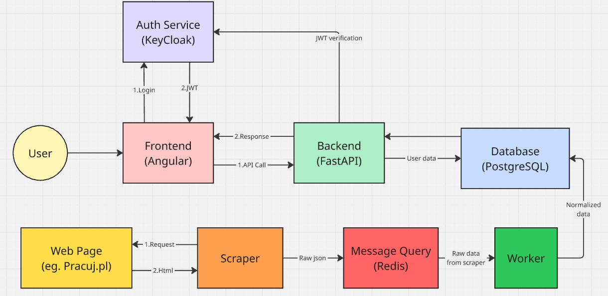

# IT-Hell

<!-- TABLE OF CONTENTS -->
<details>
  <summary>Table of Contents</summary>
  <ol>
    <li>
      <a href="#about-the-project">About The Project</a>
      <ul>
        <li><a href="#built-with">Built With</a></li>
      </ul>
    </li>
    <li>
      <a href="#getting-started">Getting Started</a>
      <ul>
        <li><a href="#prerequisites">Prerequisites</a></li>
        <li><a href="#installation">Installation</a></li>
      </ul>
    </li>
    <li><a href="#usage">Usage</a></li>
    <li><a href="#architecture">Architecture</a></li>
  </ol>
</details>

## About The Project

IT-Hell is a comprehensive platform designed to streamline the IT job search process. It automates the collection of job offers from major Polish job boards, processes them through a dedicated data pipeline, and provides tools for CV analysis.

The project is structured as a microservices-based application, ensuring scalability and separation of concerns. Detailed documentation for each component is available in their respective directories.

### Built With

*   **Docker**: Containerization and orchestration.
*   **FastAPI (Python)**: High-performance backend API.
*   **Angular (TypeScript)**: Modern web frontend.
*   **PostgreSQL**: Relational database for persistent storage.
*   **Redis**: Message broker and task queue management.
*   **Keycloak**: Identity and Access Management.

## Getting Started

To get a local copy up and running, follow these simple steps.

### Prerequisites

*   Docker
*   [uv](https://docs.astral.sh/uv/getting-started/installation/) (for local development outside Docker)

### Installation

1.  Clone the repo
    ```sh
    git clone git@github.com:KluskaGit/IT-Hell.git
    ```
2.  Set up environment variables. Copy the `.env_template` to `.env` in the root directory and adjust the values.
3.  Build and start the services using Docker Compose:
    ```sh
    docker compose up -d --build
    ```

## Usage
**Attention**: The first KeyCloak startup may take a few minutes.
### Keycloak Setup
1. Navigate to http://127.0.0.1:8080/admin/master/console/#/master/realms
2. Log in with the default credentials (`admin`/`admin`).
3. Click `Create realm`.
4. Import configuration from `frontend/it-hell-realm.json` file.
5. Create


Once the services are running, you can access the following entry points:
*  **Frontend**: [http://localhost:4200](http://localhost:4200)
*   **API Documentation**: [http://localhost:8000/docs](http://localhost:8000/docs) (Swagger UI)
*   **Keycloak Admin**: [http://localhost:8080](http://localhost:8080) (Default credentials: `admin`/`admin`)
*   **PostgreSQL**: Exposed on the port specified in your `.env`

## Architecture

IT-Hell follows a microservices architecture to handle the full lifecycle of job offer data:

1.  **[Scrapers](./scrapers/README.md)**: Asynchronously fetch job listings from Polish IT job boards and push them to Redis.
2.  **Message Broker**: Redis serves as the communication hub between scrapers and the worker.
3.  **[Worker](./backend/worker.md)**: Consumes data from Redis, normalizes it, and stores it in the database.
4.  **Database**: PostgreSQL stores all structured job data and user profiles.
5.  **[Backend API](./backend/backend.md)**: Serves the processed data and handles business logic, including CV analysis.
6.  **Auth**: Keycloak manages user authentication and authorization.
7.  **[Frontend](./frontend/README.md)**: Angular-based dashboard for users to browse offers and analyze CVs.

### System architecture diagram



## Features
* **Autofill technologies from CV**: After uploading a CV, the system automatically extracts technologies and applies them as filters for job search.
* **Autofill from user profile (logged users only)**: For logged-in users, the system can aplly filters based on the technologies and experience level listed in their profile.
* **Access to all offers (logged users only)**: Logged-in users can access all job offers, while non-logged users have access to a limited set of offers.

## Not implemented features
* **User account removal/editing**: Currently, users cannot edit personal informations or remove their accounts. This feature is planned for future development.
* **Sorting offers**: The current implementation does not support sorting job offers by criteria such as date or relevance. This feature is also planned for future development.
* **Dynamic filters**: Since filter is selected others are not updated. For example, if user selects "AI/ML" specialization, the technologies filter will not be updated to show only technologies related to AI/ML. This feature is planned for future development.
* **The same offer from different sources**: The system does not currently handle duplicate job offers that may appear on multiple job boards. This feature is planned for future development.