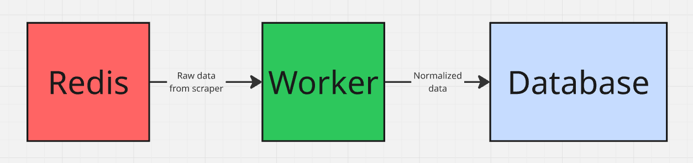

# Worker Module Documentation

The `worker` module is an asynchronous background service responsible for consuming scraped job offers from a Redis stream, normalizing the data, and securely saving it to the database.

## Getting started
1. **Environment Setup**:
   - Ensure you have Python 3.8+ installed.
   - Install the [uv](https://docs.astral.sh/uv/getting-started/installation/) package manager if you haven't installed yet.
   - Ensure you have configured PostgreSQL and Redis correctly.
2. **Install dependencies**:
   - Run `uv sync` to install the required dependencies from `pyproject.toml`.
3. **Setup environment variables**:
   - Create a `.env` file in the root of the project with the following content (adjust values as needed):
     ```
      POSTGRES_USER=
      POSTGRES_PASSWORD=
      POSTGRES_HOST=
      POSTGRES_PORT=
      POSTGRES_DB=

      REDIS_HOST=
      REDIS_PORT=
      REDIS_DB=
      REDIS_PASSWORD=
      REDIS_STREAM=
      REDIS_GROUP=
      REDIS_CONSUMER=

     ```
4. **Run the Worker**:
   - Execute `uv run -m worker.main` to start the worker process. It will continuously listen for new job offers in the Redis stream and process them accordingly.

## Architecture and Data Flow

1. **Redis Consumption (`worker/main.py`)**:
   - The main loop uses `redis.asyncio` to listen to a data stream (configured via `settings.REDIS_STREAM`).
   - It implements Consumer Groups (`xgroup_create`, `xreadgroup`) to allow parallel processing and prevent duplicate handling.
   - Once a message is successfully processed, the worker sends an acknowledgement (`xack`).

2. **Database Storage (`worker/job_offers.py`)**:
   - Data fetched from Redis in JSON format is converted into a `JobOfferScraperCreate` schema.
   - The `save_job_offer_to_db` function uses the `get_job_offers_service()` context manager, ensuring proper transaction handling.
   - If an offer is deemed unwanted, a `DiscardException` is raised, and the worker skips the entry.

3. **Data Normalization (`worker/pipeline.py` and `worker/normalize/`)**:
   - The `JobOfferScraperCreate` object is passed to the `normalize_offer` function, which modifies it in-place.
   - Normalization uses regular expressions (regex) to map various text formats into a consistent, unified format (e.g., "Mid / Regular" -> "Mid").
   - Key normalization areas:
     - Experience levels (`EXPERIENCE_LEVELS` in `exp_lvls.py`).
     - Technology names (`TECHNOLOGIES` in `technologies.py`).
     - Employment types (`WORK_TYPES` in `work_types.py`).
     - Whitespace removal (strip) and location formatting (title case).

### Diagram of Data Flow


## Key Files

- **`worker/main.py`** - Definition and entry point for the `Worker` class. Manages the Redis connection lifecycle and streams.
- **`worker/pipeline.py`** - Business logic for normalizing offers before storage.
- **`worker/job_offers.py`** - Handles individual records and interacts with the service layer (`JobOffersService`).
- **`worker/core/deps.py`** - Dependency Injection and async context managers providing database services.
- **`worker/core/redis.py`** - Redis client connection setup based on environment variables.
- **`worker/normalize/__init__.py`** - String mapping logic (functions `normalize_string`, `normalize_strings`).