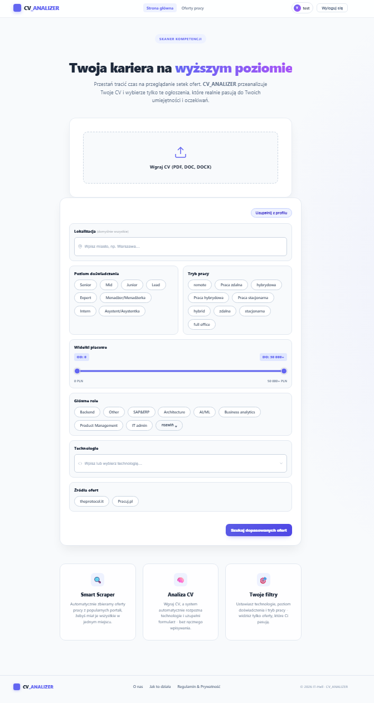
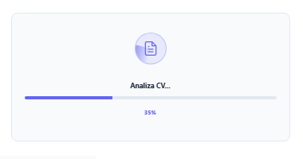
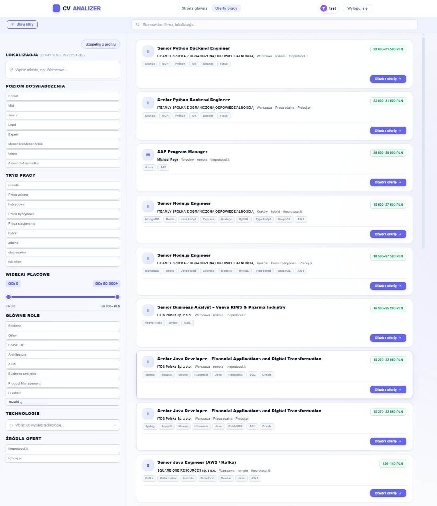
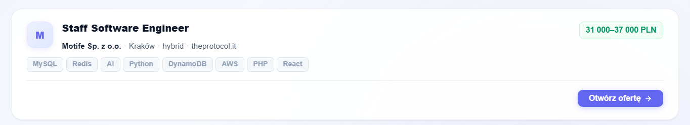
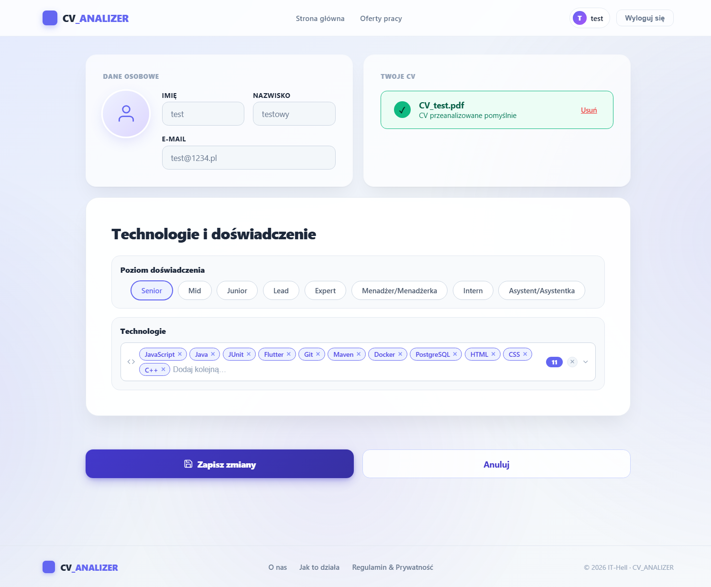

# Frontend Architecture and Developer Guide

The Angular 21 web layer of **IT-Hell**: the user drops a CV (PDF/DOCX), the app extracts
technologies, and matches them against job offers scraped from Polish job boards. This document
covers **only the frontend**. The full-stack setup (`docker compose up`), the Keycloak realm and the
system architecture live in the **[root README](../README.md)**.
---
<div align="center">
  
</div>

---

## Layered Architecture

The application is a **100% standalone-component** Angular 21 SPA — there is no `NgModule`. Each
component declares its own dependencies in `imports`, which improves tree-shaking and removes hidden
dependency-injection chains. Providers are configured functionally in `src/app/app.config.ts`
(`provideRouter`, `provideHttpClient(withFetch(), withInterceptors([authInterceptor]))`,
`LOCALE_ID = 'pl'`, and the auth `APP_INITIALIZER`).

The source code is organized into three layers:

1. **Core (`src/app/core/`)**: application-wide singletons (`providedIn: 'root'`). Holds the API
   services (`UserApiService`, `CvApiService`, `JobOffersApiService`, `LookupsApiService`), the
   route guard (`authGuard`), and the DTO models (`offers.models.ts`). Stateless except for an
   in-memory lookup cache.
2. **Shared (`src/app/shared/`)**: reusable, presentation-focused components used across pages — the
   filter form, the navbar/footer, the autocomplete pickers and the highlight helper. They own UI
   logic only and receive data through `@Input`/`@Output`.
3. **Features (`src/features/`)**: one folder per route (home, offers, profile, about, legal), plus
   the `AuthService`. Each feature orchestrates shared components and core services into a page.

### Cross-cutting decisions

- **Reactivity**: global state (login status, username) is held in **Angular Signals**, read
  synchronously in templates with no subscription or `async` pipe. RxJS is used only where it fits —
  `HttpClient` streams (converted to Promises with `firstValueFrom()` where convenient) and
  debounced UI event streams.
- **Change detection**: heavily-updated components (e.g. `OffersComponent`) use
  `ChangeDetectionStrategy.OnPush` with manual `markForCheck()` after async updates, so a 500-offer
  list does not re-render the whole tree on every event.
- **State management**: there is **no global store** (NgRx/NGXS). State is distributed across
  Signals (auth), a `FormGroup` (filters), `localStorage` (filter persistence under
  `cv_analizer_candidate_filters`), `history.state` (filters passed between routes), URL query
  params (shareable links), and an in-memory lookup cache. When `OffersComponent` loads, filters are
  resolved by priority: **URL query params > history.state > localStorage > defaults**.
- **HTTP layer**: a single functional interceptor (`authInterceptor`) attaches
  `Authorization: Bearer <token>` **only to `/v1/*` requests**. There is no error interceptor —
  each component handles 401/404/500 with its own strategy (toast, banner, fallback).
- **Memory safety**: components with long-lived subscriptions use the `destroy$ + takeUntil`
  pattern and tear down timers, `IntersectionObserver`s and the token-refresh interval in
  `ngOnDestroy`.

---

## Routing

Routes are defined in `src/app/app.routes.ts`, with per-route SSR render modes in
`app.routes.server.ts`.

| Path | Component | Guard | Notes |
|---|---|---|---|
| `/` | `HomeComponent` | — | CV dropzone + filter form |
| `/offers` | `OffersComponent` | — | List + infinite scroll; **client-only** |
| `/profile` | `ProfileComponent` | `authGuard` | Logged-in users only |
| `/about` | `AboutComponent` | — | Static |
| `/legal` | `LegalComponent` | — | Terms + FAQ (tabs via `?tab=`) |
| `/login`, `/register`, `/forgot-password` | redirect → `/` | — | Handled by Keycloak |
| `**` | redirect → `/` | — | Catch-all |

`/offers` is client-only because it depends on `IntersectionObserver`, `localStorage` and
`history.state` — none available during server-side rendering.

---

## Feature Pages

The `features/` layer holds one folder per route. Each page composes shared components and core
services; the heavier pages keep their flow logic in the component class.

1. **Home (`/`)**: validates a dropped CV (`.pdf`/`.doc`/`.docx`, max 10 MB), uploads it for
   analysis, and shows a scanning animation. The progress bar is **purely cosmetic** — the backend
   returns no real-time progress; the jump to 35 % then to 100 % is UX only. On success the detected
   technologies are patched into the shared filter form and persisted to `localStorage`. "Search"
   navigates to `/offers`, passing the filters through `history.state`. Logged-in users can pre-fill
   the form from their saved profile.

   <div align="center">
     
   </div>

2. **Offers (`/offers`)**: the most complex page (~628 lines). It accumulates offers through
   **infinite scroll** (an `IntersectionObserver` on a sentinel element, `rootMargin: 200px`),
   debounces filter changes (700 ms) and the title search (500 ms) on separate streams, and keeps
   the active filters in the URL using short aliases (`roles`, `seniority`, `tech`, …). Salary
   filtering, sorting and "matched technology" enrichment happen client-side; offers without a
   stated salary always pass the range filter. The sidebar is resizable by dragging (240–480 px,
   width persisted to `localStorage`).

   <div align="center">
     
   </div>

   <div align="center">
     
   </div>

3. **Profile (`/profile`)**: protected by `authGuard`. Loads in two stages — basic fields
   (name, e-mail) come **synchronously from the JWT**, then the backend is queried for the full
   profile. A `404` from `GET /v1/users/me/profile` is **expected** for new users and treated as an
   empty profile, not an error. Saving issues an UPSERT to `PUT /v1/users/me/profile`. The shared
   filter form is trimmed to seniority (single selection) and technologies.

   <div align="center">
     
   </div>

4. **About (`/about`)**: a static presentation page — an empty component class, all content in the
   template.
5. **Legal (`/legal`)**: two tabs ("how it works" / "terms") plus a single-open FAQ accordion. The
   active tab is synced to `?tab=` with `replaceUrl: true`, so switching tabs does not pollute the
   browser history.

---

## Shared Components

1. **`FiltersFormComponent`**: the central, reusable filter form used by Home, Offers and Profile.
   It loads all lookups **in parallel** via `forkJoin` (sections hidden by `@Input` fall back to
   `of([])`, saving a request), exposes ~15 visibility/behavior `@Input` flags, and emits `ready`
   (once, after the first init — Offers waits for it before its first fetch), `filtersChange`,
   `applyClicked` and `profileFillClicked`. Its loaded lookups are **public** so parent pages can
   format raw IDs into readable labels.
2. **`NavbarComponent` / `FooterComponent`**: presentation only. The navbar reads the
   `isAuthenticated` and `username` Signals from `AuthService` and is reactive without local state.
3. **`TechPickerComponent` / `LocationPickerComponent`**: autocomplete multi-selects over the shared
   `LocationItem` (`{ id, name }`) type — the app's main lookup shape. They handle click-outside,
   Escape and scroll-to-close, and use `mousedown` (not `click`) on options so selection registers
   before `blur` hides the dropdown.
4. **`highlight.ts`**: `highlightMatch(name, query, color)` wraps the matched substring in a
   `<strong>` tag for the autocomplete dropdowns. Every raw segment is HTML-escaped before
   insertion, making the `[innerHTML]` output **XSS-safe**; the color argument is code-controlled.

---

## API Layer (Services)

All API services live in `src/app/core/services/` (except `AuthService` in `src/features/auth/`) and
are standalone singletons. `JobOffersApiService`, `LookupsApiService` and `CvApiService` return
`Observable<T>` so the component decides how to subscribe (`takeUntil`); `UserApiService` returns
`Promise<T>` via `firstValueFrom()` so components can `await` it. The JWT is attached automatically
by `authInterceptor` — services never deal with auth headers.

| Service | Backend endpoints |
|---|---|
| `UserApiService` | `GET /v1/users/me`, `GET`/`PUT /v1/users/me/profile` |
| `CvApiService` | `POST /v1/cv/upload` (multipart) |
| `JobOffersApiService` | `GET /v1/job-offers/get_offer_filter` |
| `LookupsApiService` | `GET /v1/lookups/*` (technologies, specializations, work-types, experience-levels, sites, locations) |
| `AuthService` | Keycloak only — does not call the API |

The base lookup DTO is `LookupDto` (`{ id, name }`), reused by every lookup and embedded in
`JobOfferApiResponse` and `UserProfileDto`. `JobOffersApiService.mapToOffer()` is a pure function
that normalizes the raw backend response into the UI's `MappedOffer`, handling `null` values, the
literal string `'None'` that FastAPI sometimes returns, and Polish fallbacks
(`'Nieznana firma'`, `'Zdalnie'`, `'Nie podano'`).

---

## Authentication (Keycloak PKCE)

The SPA authenticates against **Keycloak 26.6** using the OAuth 2.0 Authorization Code flow with
**PKCE (S256)** — the standard for public clients that cannot store a secret. `AuthService` wraps
`keycloak-js` behind a Signal-based, async/await API. The full flow:

1. **Bootstrap**: an `APP_INITIALIZER` blocks startup on `AuthService.init()`
   (`onLoad: 'check-sso'`, `pkceMethod: 'S256'`), wrapped in `Promise.race` with a **5-second
   timeout**. If Keycloak is unreachable, the app still loads, logged-out. This guarantees the navbar
   and guard know the auth state from the first frame.
2. **Login**: `authGuard` (a `CanActivateFn` protecting `/profile`) redirects unauthenticated users
   to the Keycloak form, then back to the requested URL. After login, `code + code_verifier` are
   exchanged for a JWT; the username is read from `tokenParsed` (`given_name`, falling back to
   `preferred_username`).
3. **API calls**: `authInterceptor` attaches the bearer token to `/v1/*` requests; the backend
   validates the JWT against the realm's RS256 public key.
4. **Auto-refresh**: a 20-second interval calls `keycloak.updateToken(30)` (refresh if it expires in
   under 30 s). If the refresh token has also expired, the service clears the local auth state and
   stops the interval — it does not redirect to the Keycloak logout endpoint.
5. **Logout**: stops the refresh interval, calls `keycloak.logout({ redirectUri: '/' })` and resets
   the Signals.

The realm config (`url`, `realm`, `clientId`) flows from `environment.ts` through
`keycloak.config.ts`. The realm itself (`frontend/it-hell-realm.json`) is **imported manually** via
the Keycloak Admin Console on first run; later edits to the JSON have no effect once the realm exists
in the `keycloak-data` volume.

---

## Server-Side Rendering (status)

The repository contains Angular SSR scaffolding (`@angular/ssr`, `main.server.ts`,
`app.config.server.ts`, `app.routes.server.ts`, an Express `server.ts`), but **SSR is not wired into
the build** — `angular.json` defines only the `browser` target. Consequently `npm run build`
produces a **client-only SPA**, the `serve:ssr:*` script is dormant, and the per-route `RenderMode`
settings take effect only once SSR is enabled. The guards that keep SSR safe are already in place:
`AuthService.init()` early-returns when not running in the browser (Keycloak touches
`window`/`document`), and `/offers` is marked `RenderMode.Client`. In Docker the app ships as static
files served by nginx.

---

## Design System

The UI is **light-mode only** and built with **hand-written CSS** — no Tailwind, Material or
Bootstrap. The palette is indigo (`--primary #6366f1`) with violet accents in gradients, on a slate
grayscale for text. Cards on `/profile` and `/offers` use **glassmorphism** (semi-transparent
background + `backdrop-filter: blur`, with the `-webkit-` prefix for Safari); `/home` stays lighter
with a plain white surface. Decoration comes from fixed, blurred radial-gradient "glow" blobs
(animated only on `/profile`). The display font is DM Sans with an Inter fallback. Two reusable CSS
patterns are worth noting: the **pill-card** technique (a visually-hidden checkbox kept in the tab
order via `opacity: 0; width/height: 0`, styled through the `:checked + .pill-content` sibling
selector) and **Angular validation styling** keyed off `.ng-invalid.ng-touched`. Components use
Angular's default emulated view encapsulation; child components are styled with `:host ::ng-deep`.

---

## Configuration

Frontend configuration is two files (neither contains secrets):

- **`src/environments/environment.ts`** — `apiUrl` (`/v1`), `keycloakUrl`, `keycloakRealm`
  (`it-hell`), `keycloakClientId` (`backend-client`). `apiUrl` is **baked into the bundle at build
  time**, so changing it requires a rebuild, not just a restart.
- **`proxy.conf.json`** — dev-only; forwards `/v1/*` to `http://localhost:8000`, so there are no
  CORS issues in development. In production the frontend's nginx performs the equivalent rewrite.

Three values must match the backend/Keycloak or login and API calls break: `keycloakRealm`
(↔ `KEYCLOAK_REALM_NAME`), `keycloakClientId` (↔ `KEYCLOAK_CLIENT_ID`) and `keycloakUrl`
(↔ `KEYCLOAK_URL`). The authoritative values live in the root `.env`.

> A production `environment.prod.ts` and the `fileReplacements` entry in `angular.json` **do not yet
> exist** — add both before the first deployment that needs non-dev URLs. When deploying the static
> build to a host without a `/v1` reverse proxy (e.g. Azure Static Web Apps), `apiUrl` must be set to
> the backend's full public URL.

---

## Local Development

Requires **Node.js 20+**. The backend, Keycloak and the database are expected to be running already
(see the [root README](../README.md) — `docker compose up -d --build`).

```bash
cd frontend
npm install
npm start            # dev server on http://localhost:4200, proxy /v1 → :8000
```

| Command | What it does |
|---|---|
| `npm start` | Dev server on `:4200` with the `/v1 → :8000` proxy and live reload |
| `npm run build` | Production build (client-only SPA) to `dist/cv-analizer/browser/` |
| `npm run watch` | Watch-mode build (development config) |
| `npm test` | Unit tests via Vitest |
| `npm run ng` | Raw Angular CLI |

---

## Docker

The frontend ships as a single service built from `frontend/Dockerfile`, a **multi-stage** build:
the `node:20-alpine` stage runs `npm ci && npm run build`, and the `nginx:1.27-alpine` stage serves
the static browser bundle from `dist/cv-analizer/browser`. `nginx.conf` proxies `/v1/` to
`backend:8000` and falls back to `index.html` for client-side routes. `compose.yaml` publishes the
service as `4200:80`. The SSR Express server is not used by the image.

---

## Testing Convention

Tests use **Vitest + jsdom** (160 tests across 17 files). They are isolated from the network and the
real Keycloak server by mocking dependencies at the boundary:

- **API services** are tested against a mocked `HttpClient`, asserting the correct method, URL and
  query parameters, and the DTO → UI mapping (e.g. `mapToOffer` normalizing `null`/`'None'`).
- **`AuthService`** overrides the protected `createKeycloak()` factory with a stub, so init, the
  Signal updates, token refresh and the refresh-failure path (clearing state, stopping the interval)
  are verified without a real Keycloak.
- **Guard and routes** are tested for the redirect-when-logged-out behavior and the route table.
- **Components** are tested for their load/error branches (e.g. profile's `404`-as-empty-profile,
  save failures, fill-from-profile errors) and basic rendering.

---

