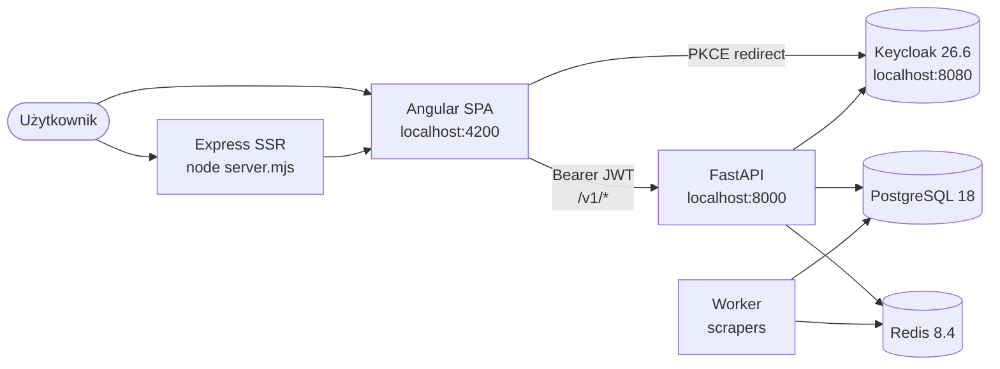
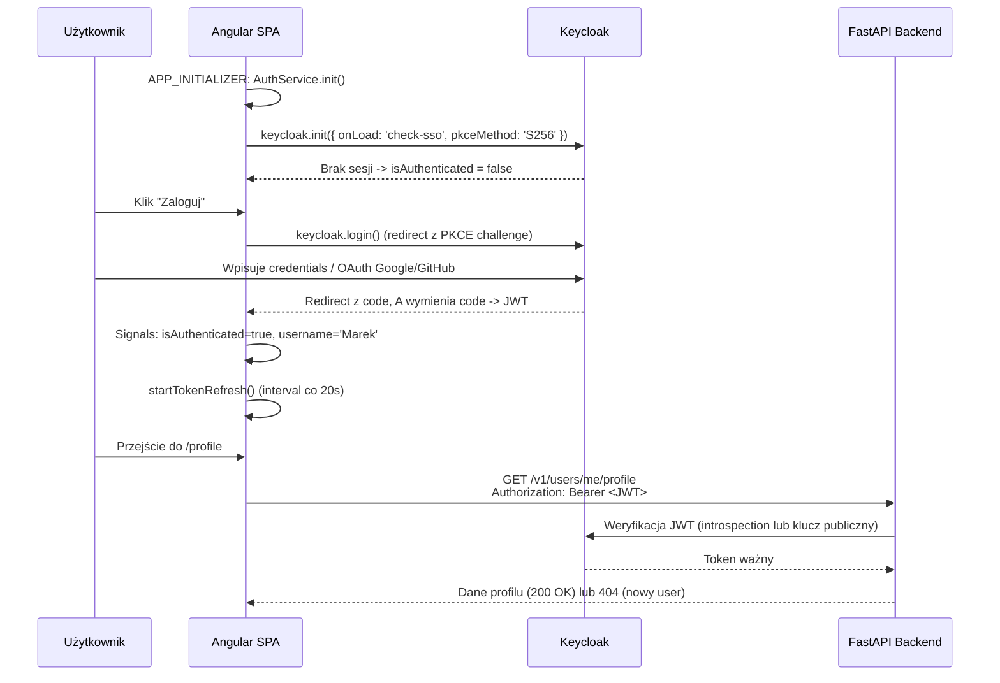

<div align="center">

# CV_ANALIZER — Frontend

### 🎯 Wgraj CV, dostań dopasowane oferty pracy IT z całej Polski

Aplikacja webowa, która automatycznie analizuje Twoje CV (PDF/DOCX), wykrywa technologie i poziom doświadczenia, a następnie dopasowuje oferty pracy zescrapowane z największych portali (Pracuj.pl, JustJoin.it, NoFluffJobs).

[](https://angular.dev/)
[](https://www.typescriptlang.org/)
[](https://www.keycloak.org/)
[](https://nodejs.org/)
[](https://angular.dev/guide/ssr)
[](LICENSE)

</div>

---

## 📑 Spis treści

- [O projekcie](#-o-projekcie)
- [Funkcje](#-funkcje)
- [Stack technologiczny](#-stack-technologiczny)
- [Architektura](#-architektura)
- [Wymagania systemowe](#-wymagania-systemowe)
- [Pierwsze uruchomienie](#-pierwsze-uruchomienie)
- [Troubleshooting](#-troubleshooting)
- [Struktura projektu](#-struktura-projektu)
- [Routing](#-routing)
- [Autentykacja](#-autentykacja)
- [Skrypty npm](#-skrypty-npm)
- [Dokumentacja rozszerzona](#-dokumentacja-rozszerzona)

---

## 🧭 O projekcie

**CV_ANALIZER** (kodowo *IT-Hell*) to fullstackowa platforma, która:

1. **Analizuje CV** w formatach PDF i DOCX — wyciąga technologie, lata doświadczenia, poziom seniority i obszar IT (frontend, backend, devops, qa, ...).
2. **Dopasowuje oferty pracy** z portali IT do profilu kandydata na podstawie filtrów (technologie, widełki wynagrodzenia, tryb pracy, lokalizacja).
3. **Integruje konta** przez Keycloak (SSO + social login Google/GitHub) z opcją zapisania CV do profilu na stałe.

Ten folder (`frontend/`) zawiera **warstwę webową** napisaną w Angular 21 (standalone components + Signals + SSR przez Express). Backend (FastAPI), Keycloak i PostgreSQL stoją w Dockerze (`compose.yaml` w katalogu głównym).

---

## ✨ Funkcje

- 🪄 **Drag & drop CV** — analiza w locie, animacja skanowania, auto-uzupełnienie formularza
- 🔍 **Zaawansowane filtry** — technologie, specjalizacja, seniority, widełki, lokalizacja, tryb pracy, portale
- ♾️ **Infinite scroll** ofert (IntersectionObserver) z resizable sidebarem
- 🔐 **Logowanie przez Keycloak** — PKCE S256, social login (Google, GitHub), auto-refresh tokenu co 20 s
- 💾 **Stały profil użytkownika** — zapis CV (base64) i preferencji do bazy, gotowy do jednego kliknięcia
- 🌐 **SSR + Hydration** — Angular Universal na Expressie, prerender stron statycznych
- 🎨 **Glassmorphism UI** — gradienty, glow effects, animowane tło
- 🇵🇱 **Locale `pl`** — formatowanie dat, walut i tekstów w języku polskim

---

## 🛠️ Stack technologiczny

| Warstwa | Technologia | Wersja |
|---|---|---|
| Framework | Angular (standalone components) | **21.2** |
| Język | TypeScript | **5.9** |
| Reaktywność | Angular Signals + RxJS | 7.8 |
| Forms | `@angular/forms` (Reactive Forms) | 21.2 |
| Routing | `@angular/router` z server routes | 21.2 |
| Auth | `keycloak-js` (PKCE S256) | 26.2 |
| SSR | `@angular/ssr` + Express | 21.2 / 5.1 |
| HTTP | `HttpClient` + Fetch + interceptors | 21.2 |
| Build | `@angular/build` | 21.2 |
| Testy | Vitest + jsdom | 4.0 / 28 |
| Package manager | npm | 11.9 |

---

## 🏗️ Architektura

Frontend komunikuje się z dwoma niezależnymi serwisami: **Keycloak** (autoryzacja i tokeny JWT) oraz **FastAPI backend** (dane domeny). Żądania do API w trybie dev są przepinane przez proxy Angular CLI.



Szczegóły w [`docs/architecture.md`](docs/architecture.md).

---

## 📋 Wymagania systemowe

Zanim zaczniesz, zainstaluj następujące narzędzia:

| Narzędzie | Wersja min. | Wersja zalecana | Sprawdzenie |
|---|---|---|---|
| **Node.js** | 20.0 | **20.x LTS** | `node -v` |
| **npm** | 10.0 | **11.x** | `npm -v` |
| **Docker Desktop** | 24 | aktualna | `docker --version` |
| **Docker Compose** | v2 | v2.x | `docker compose version` |
| **Git** | 2.30 | aktualna | `git --version` |
| **System** | Windows 10+ / macOS 12+ / Linux | — | — |
| **Przeglądarka** | Chrome / Firefox / Edge z ES2022 | aktualna | — |

> 💡 **Angular CLI** nie musi być instalowany globalnie — projekt używa lokalnego CLI przez `npm start`.

**Linki instalatorów:**
- [Node.js LTS](https://nodejs.org/en/download)
- [Docker Desktop](https://www.docker.com/products/docker-desktop/)
- [Git for Windows](https://git-scm.com/download/win)

---

## 🚀 Pierwsze uruchomienie

Aplikacja składa się z **trzech warstw**, które muszą działać równocześnie:

1. **Docker** — backend FastAPI, Keycloak, PostgreSQL, Redis, worker, scrapery
2. **Frontend Angular** — dev server na porcie 4200
3. **Twoja przeglądarka** — `http://localhost:4200`

Wykonaj poniższe etapy **w kolejności**. Każdy etap zawiera komendy gotowe do skopiowania.

---

### Etap A — Sklonuj repozytorium

```bash
git clone https://github.com/KluskaGit/IT-Hell.git
cd IT-Hell
```

Zweryfikuj strukturę:

```
IT-Hell/
├── backend/       # FastAPI + SQLAlchemy + Alembic
├── frontend/      # Angular 21 (TEN folder)
├── keyCloak/      # konfiguracja Keycloak
├── scrapers/      # scrapery ofert pracy
└── compose.yaml   # orkiestracja Dockera
```

---

### Etap B — Skonfiguruj zmienne środowiskowe

W katalogu głównym (`IT-Hell/`) musi istnieć plik **`.env`** z konfiguracją używaną przez `compose.yaml`. Jeśli nie ma — utwórz go (skopiuj z `.env.example` jeśli istnieje, albo poproś osobę z zespołu o aktualne wartości). Minimalne klucze:

```env
POSTGRES_PORT=5432
POSTGRES_USER=...
POSTGRES_PASSWORD=...
POSTGRES_DB=...
REDIS_PORT=6379
REDIS_PASSWORD=...
# + pozostałe wymagane przez backend (KEYCLOAK_*, GOOGLE_*, ...)
```

> ⚠️ Bez `.env` Docker nie uruchomi PostgreSQL ani Redis i backend zwróci błędy połączenia.

---

### Etap C — Uruchom backend, Keycloak i bazę (Docker)

```bash
docker compose up -d --build
```

Komenda uruchamia **siedem kontenerów**:

| Kontener | Port | Funkcja |
|---|---|---|
| `database` | 5432 | PostgreSQL 18 (dane aplikacji) |
| `message-broker` | 6379 | Redis 8.4 (kolejka zadań) |
| `keycloak-dev` | 8080 | Keycloak 26.6 (auth) |
| `backend` | 8000 | FastAPI (REST API `/v1/*`) |
| `migrations` | — | jednorazowo: `alembic upgrade head` |
| `worker` | — | konsumer kolejki Redis |
| `scrapers` | — | scrapery ofert (Pracuj/JJIT/NFJ) |

Sprawdź status:

```bash
docker compose ps
```

Wszystkie powinny być w stanie `running` (albo `exited (0)` dla `migrations` — to normalne, kontener zamyka się po wykonaniu migracji).

Sprawdź logi backendu jeśli coś nie działa:

```bash
docker compose logs backend
docker compose logs keycloak
```

**Pierwszy start Keycloaka trwa ~30-60 sekund** — importuje realm `it-hell` z pliku `backend/keycloak/import/it-hell-realm.json`. Poczekaj aż w logach pojawi się `Listening on: http://0.0.0.0:8080`.

**Health checki:**

| URL | Co powinno się zwrócić |
|---|---|
| http://localhost:8080 | Strona logowania admina Keycloak (login: `admin` / hasło: `admin`) |
| http://localhost:8000/docs | Swagger UI z dokumentacją API FastAPI |
| http://localhost:8000/v1/lookups/technologies | JSON z listą technologii (test endpointa) |

---

### Etap D — Zainstaluj zależności frontendu

```bash
cd frontend
npm install
```

**Pierwsza instalacja zajmuje 2-5 minut** (ok. 800 paczek przez `node_modules`). Możliwe ostrzeżenia o `peer dependencies` — można je zignorować dopóki nie są oznaczone jako `ERR`.

---

### Etap E — Uruchom dev server Angulara

```bash
npm start
```

Po skompilowaniu (10-30 s) zobaczysz:

```
➜ Local:   http://localhost:4200/
```

Dev server używa **proxy** z `proxy.conf.json` — żądania do `/v1/*` są automatycznie przepinane na `http://localhost:8000/v1/*` (omija CORS).

---

### Etap F — Przetestuj logowanie

1. Otwórz **http://localhost:4200** w przeglądarce.
2. Strona główna — wgraj testowe CV (przeciągnij plik PDF/DOCX w dropzone) i sprawdź czy analiza zwraca wykryte technologie.
3. Kliknij **„Zaloguj"** w nawigacji — zostaniesz przekierowany do formularza Keycloak (`localhost:8080`).
4. Wybierz **„Register"** żeby założyć konto, albo zaloguj się przez Google/GitHub (jeśli social providery są skonfigurowane w realmie).
5. Po zalogowaniu wracasz na frontend — sprawdź czy w nawigacji widać Twoje imię i czy `/profile` jest dostępne.

🎉 **Gotowe!** Aplikacja działa lokalnie.

---

## ⚠️ Troubleshooting

| Problem | Prawdopodobna przyczyna | Rozwiązanie |
|---|---|---|
| Frontend pokazuje **CORS error** na PUT/POST | Backend zwrócił 500 (crash) — odpowiedź nie ma nagłówków CORS | `docker compose logs backend` — popraw błąd backendu, **nie** dotykaj nagłówków CORS |
| **Realm `it-hell` not found** w Keycloak | Volume `keycloak-data` istnieje, ale realm nie został zaimportowany | `docker compose down -v` (UWAGA: kasuje wszystkich userów Keycloak) → `docker compose up -d --build` |
| Keycloak **nie startuje** | Port 8080 zajęty przez inny proces | Windows: `netstat -ano \| findstr :8080` → zabij proces. Linux/Mac: `lsof -i :8080` |
| `npm install` **fails** z `EBADENGINE` | Wersja Node < 20 | Zainstaluj Node 20 LTS, sprawdź `node -v` |
| Logowanie **kończy się błędem SSR** | Trasa nie ustawiona na `RenderMode.Client` | Sprawdź `src/app/app.routes.server.ts` — `/offers` musi być `Client`, reszta `Prerender` |
| Backend zwraca **401 Unauthorized** | Token wygasł lub brak headera | Hard refresh przeglądarki (Ctrl+Shift+R) — `AuthService` re-init wczyta świeży token |
| **`docker compose` not found** | Docker Desktop nie zainstalowany lub nie uruchomiony | Uruchom Docker Desktop i poczekaj aż ikona w trayu zrobi się zielona |
| Frontend ładuje się **bez stylów** | Pierwszy build SSR jeszcze trwa | Poczekaj — `npm start` przy pierwszym uruchomieniu kompiluje też wersję serwerową |
| `/profile` **przekierowuje do `/`** zamiast Keycloaka | Sesja Keycloak wygasła, ale frontend tego nie wykrył | Wyczyść cookies dla `localhost:8080` i `localhost:4200`, hard refresh |

> 📚 Dodatkowo zobacz [`docs/auth-flow.md`](docs/auth-flow.md) — pełen flow PKCE z punktami awarii.

---

## 📁 Struktura projektu

Drzewo folderu `frontend/` z opisami plików:

```
frontend/
├── public/                              # statyczne pliki (favicon, obrazki) - kopiowane do dist/
│
├── src/
│   ├── app/
│   │   ├── core/                        # singletony używane globalnie (services, guards, models)
│   │   │   ├── guards/
│   │   │   │   └── auth.guard.ts        # CanActivateFn - blokuje /profile gdy niezalogowany
│   │   │   ├── models/
│   │   │   │   └── offers.models.ts     # DTO: JobOfferApiResponse, LookupDto, MappedOffer
│   │   │   └── services/
│   │   │       ├── job-offers-api.service.ts    # GET /v1/job-offers/get_offer_filter
│   │   │       ├── user-api.service.ts          # GET/PUT /v1/users/me/profile
│   │   │       ├── cv-api.service.ts            # POST /v1/cv/upload (multipart, analiza CV)
│   │   │       └── lookups-api.service.ts       # GET /v1/lookups/* (techs, locations, sites)
│   │   │
│   │   ├── shared/                      # komponenty wielokrotnego użytku
│   │   │   ├── filters-form/            # ⭐ KLUCZOWY - reużywalny formularz filtrów (home/offers/profile)
│   │   │   ├── navbar/                  # górna belka z login/logout + nazwa usera
│   │   │   ├── footer/                  # stopka z linkami do /about, /legal
│   │   │   ├── location-picker/         # multi-select miast z autocomplete
│   │   │   ├── tech-picker/             # multi-select technologii z autocomplete
│   │   │   └── highlight.ts             # helper do podświetlania dopasowań tekstu
│   │   │
│   │   ├── app.ts                       # root standalone component (template aplikacji)
│   │   ├── app.config.ts                # providery: routing, HttpClient, auth interceptor, APP_INITIALIZER
│   │   ├── app.config.server.ts         # merge z appConfig + provideServerRendering()
│   │   ├── app.routes.ts                # definicja tras Angular Router (klient)
│   │   ├── app.routes.server.ts         # RenderMode per route (Client vs Prerender)
│   │   └── keycloak.config.ts           # mapowanie environment -> Keycloak config (url/realm/clientId)
│   │
│   ├── features/                        # główne strony aplikacji (lazy-ready)
│   │   ├── auth/
│   │   │   └── auth.service.ts          # ⭐ Keycloak: init, login, logout, Signals isAuthenticated/username
│   │   ├── home/                        # strona / - drop CV, formularz filtrów, hero
│   │   ├── offers/                      # strona /offers - lista ofert + infinite scroll + sidebar
│   │   ├── profile/                     # strona /profile - dane usera + CV + preferencje
│   │   ├── about/                       # strona /about - statyczna prezentacja projektu
│   │   └── legal/                       # strona /legal - regulamin + FAQ (zakładki)
│   │
│   ├── environments/
│   │   └── environment.ts               # apiUrl=/v1, keycloakUrl, realm=it-hell, clientId=backend-client
│   │
│   ├── index.html                       # szablon entry HTML
│   ├── main.ts                          # bootstrap CSR (bootstrapApplication)
│   ├── main.server.ts                   # bootstrap SSR
│   ├── server.ts                        # Express runtime dla SSR (node serwuje dist)
│   └── styles.css                       # globalne style (importy fontów, reset, zmienne CSS)
│
├── docs/                                # 📚 dokumentacja rozszerzona (architecture, features, api, auth)
│
├── proxy.conf.json                      # proxy dev: /v1 -> http://localhost:8000
├── angular.json                         # konfiguracja Angular CLI (build, serve, test)
├── tsconfig.json                        # bazowa konfiguracja TypeScript
├── tsconfig.app.json                    # TypeScript dla aplikacji
├── tsconfig.spec.json                   # TypeScript dla testów (Vitest)
├── package.json                         # zależności + skrypty npm
├── package-lock.json                    # lockfile zależności
└── README.md                            # ten plik
```

**Konwencje:**

- `core/` — kod używany globalnie (1 singleton na całą aplikację, ładowany raz przy starcie)
- `shared/` — komponenty UI używane przez wiele features (formularz filtrów, navbar, pickery)
- `features/` — pojedyncze strony, każdy folder = jedna trasa, własne komponenty/style
- Brak `NgModule` — projekt w 100% używa **standalone components** (Angular 14+)

---

## 🗺️ Routing

Tabela tras (`src/app/app.routes.ts` + `src/app/app.routes.server.ts`):

| Ścieżka | Komponent | Auth Guard | SSR Mode | Uwagi |
|---|---|---|---|---|
| `/` | `HomeComponent` | — | `Prerender` | Drop CV + formularz filtrów |
| `/offers` | `OffersComponent` | — | **`Client`** | Wymaga `IntersectionObserver` i `localStorage` |
| `/profile` | `ProfileComponent` | ✅ `authGuard` | `Prerender` | Tylko dla zalogowanych |
| `/about` | `AboutComponent` | — | `Prerender` | Statyczna |
| `/legal` | `LegalComponent` | — | `Prerender` | Zakładki sterowane `?tab=` |
| `/login`, `/register`, `/forgot-password` | redirect → `/` | — | — | Obsługa przez Keycloak |
| `**` | redirect → `/` | — | — | Catch-all |

> 💡 `/offers` jest **client-only** ponieważ używa `IntersectionObserver` (infinite scroll), `localStorage` (cache filtrów) i `history.state` (przekazanie filtrów z `/`) — wszystkie API niedostępne w Node.js (SSR).

---

## 🔐 Autentykacja

Pełny flow logowania używa **Keycloak 26.6** z **PKCE S256** (rekomendowany standard OAuth2 dla SPA).



**Kluczowe elementy:**

- **`AuthService`** (`src/features/auth/auth.service.ts`) — singleton z Signals (`isAuthenticated`, `username`)
- **Auth Interceptor** (`src/app/app.config.ts:14-21`) — dodaje `Authorization: Bearer <token>` do każdego żądania na `/v1/*`
- **`authGuard`** (`src/app/core/guards/auth.guard.ts`) — `CanActivateFn` chroniący `/profile`, redirect do Keycloak gdy brak sesji
- **APP_INITIALIZER** (`src/app/app.config.ts:31-40`) — blokuje bootstrap na max 5 s czekając aż Keycloak odpowie (aplikacja działa nawet gdy Keycloak nieosiągalny)
- **Auto-refresh** — `window.setInterval` co 20 s wywołuje `keycloak.updateToken(30)` (token musi być ważny ≥ 30 s)

Pełen opis w [`docs/auth-flow.md`](docs/auth-flow.md).

---

## 📜 Skrypty npm

Dostępne skrypty (`package.json`):

| Komenda | Co robi |
|---|---|
| `npm start` | Uruchamia dev server na `:4200` z proxy `/v1 -> :8000` i live reload |
| `npm run build` | Build produkcyjny (CSR + SSR) do `dist/cv-analizer/` |
| `npm run watch` | Build w trybie watch (development config, bez optymalizacji) |
| `npm test` | Uruchamia testy jednostkowe przez Vitest |
| `npm run serve:ssr:cv-analizer` | Uruchamia serwer SSR z `dist/cv-analizer/server/server.mjs` (po `npm run build`) |
| `npm run ng` | Surowy Angular CLI (np. `npm run ng -- generate component ...`) |

---

## 📚 Dokumentacja rozszerzona

Szczegółowe opisy poszczególnych warstw projektu znajdziesz w folderze [`docs/`](docs/):

| Plik | Zawartość |
|---|---|
| [`docs/architecture.md`](docs/architecture.md) | Wzorce Angular 21: standalone, Signals, OnPush, SSR/Hydration, state management |
| [`docs/features.md`](docs/features.md) | Szczegółowy opis każdego feature (home, offers, profile, about, legal) + shared components |
| [`docs/api-services.md`](docs/api-services.md) | Lista wszystkich serwisów API, DTO, endpointy backendu, proxy config |
| [`docs/auth-flow.md`](docs/auth-flow.md) | Pełen flow Keycloak PKCE, interceptor, guard, refresh tokenu, troubleshooting |


---

<div align="center">

**Część projektu IT-Hell** • [Backend](../backend) • [Scrapers](../scrapers) • [Keycloak Config](../keyCloak)

Made with ❤️ in Poland

</div>
