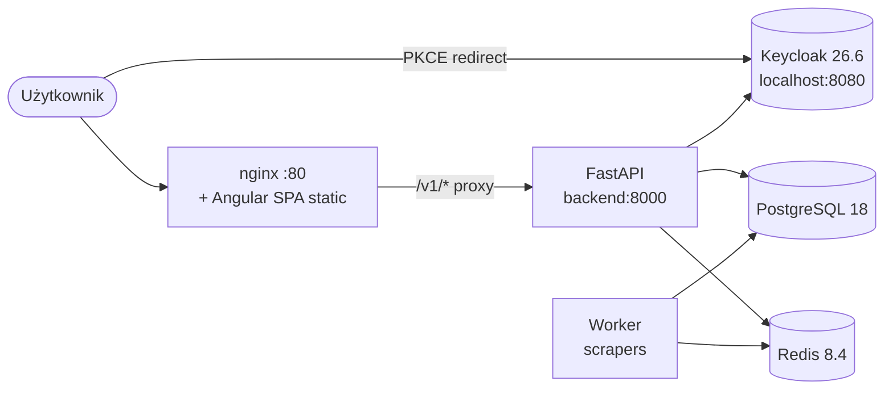
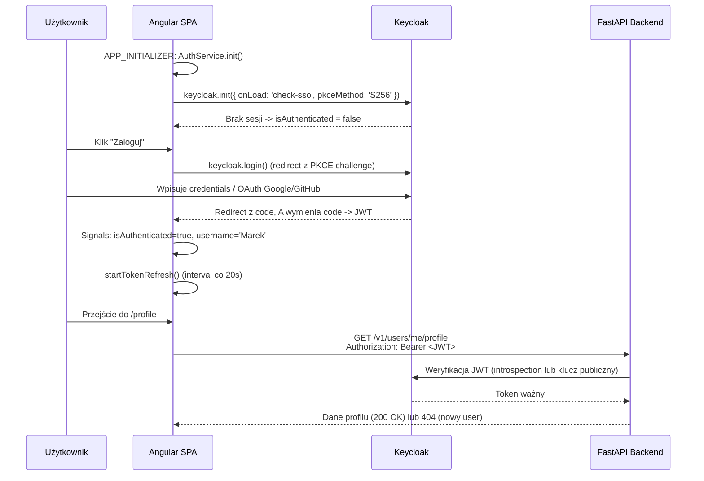
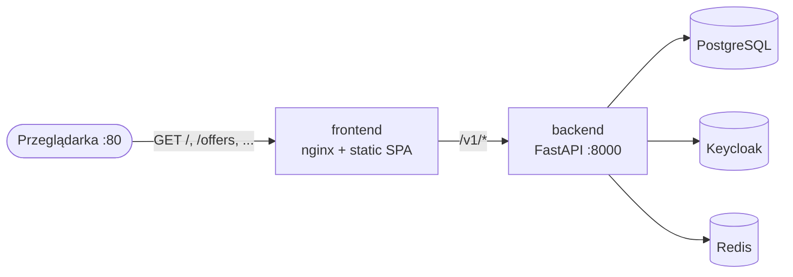

<div align="center">

# CV_ANALIZER — Frontend

### 🎯 Wgraj CV, dostań dopasowane oferty pracy IT z całej Polski

Aplikacja webowa, która automatycznie analizuje Twoje CV (PDF/DOCX), wykrywa technologie i poziom doświadczenia, a następnie dopasowuje oferty pracy zescrapowane z największych portali (Pracuj.pl, JustJoin.it, NoFluffJobs).

[](https://angular.dev/)
[](https://www.typescriptlang.org/)
[](https://www.keycloak.org/)
[](https://nodejs.org/)
[](https://nginx.org/)
[](https://docs.docker.com/compose/)

</div>

<div align="center">
  
</div>

---

## 📑 Spis treści

- [O projekcie](#-o-projekcie)
- [Funkcje](#-funkcje)
- [Stack technologiczny](#-stack-technologiczny)
- [Architektura](#-architektura)
- [Wymagania systemowe](#-wymagania-systemowe)
- [Pierwsze uruchomienie](#-pierwsze-uruchomienie)
- [Troubleshooting](#-troubleshooting)
- [Struktura projektu](#-struktura-projektu)
- [Routing](#-routing)
- [Autentykacja](#-autentykacja)
- [Skrypty npm](#-skrypty-npm)
- [Uruchomienie pełnego stacku w Dockerze](#-uruchomienie-pełnego-stacku-w-dockerze)
- [Deployment na chmurę](#%EF%B8%8F-deployment-na-chmurę)
- [Dokumentacja rozszerzona](#-dokumentacja-rozszerzona)

---

## 🧭 O projekcie

**CV_ANALIZER** (kodowo *IT-Hell*) to fullstackowa platforma, która:

1. **Analizuje CV** w formatach PDF i DOCX — wyciąga technologie, lata doświadczenia, poziom seniority i obszar IT (frontend, backend, devops, qa, ...).
2. **Dopasowuje oferty pracy** z portali IT do profilu kandydata na podstawie filtrów (technologie, widełki wynagrodzenia, tryb pracy, lokalizacja).
3. **Integruje konta** przez Keycloak (SSO + social login Google/GitHub) z opcją zapisania CV do profilu na stałe.

Ten folder (`frontend/`) zawiera **warstwę webową** napisaną w Angular 21 (standalone components + Signals). W produkcji aplikacja jest builduowana jako klasyczna SPA i serwowana przez nginx (który równocześnie pełni rolę reverse proxy do API). Backend (FastAPI), Keycloak i PostgreSQL stoją w Dockerze (`compose.yaml` w katalogu głównym).

---

## ✨ Funkcje

- 🪄 **Drag & drop CV** — analiza w locie, animacja skanowania, auto-uzupełnienie formularza
- 🔍 **Zaawansowane filtry** — technologie, specjalizacja, seniority, widełki, lokalizacja, tryb pracy, portale
- ♾️ **Infinite scroll** ofert (IntersectionObserver) z resizable sidebarem
- 🔐 **Logowanie przez Keycloak** — PKCE S256, social login (Google, GitHub), auto-refresh tokenu co 20 s
- 💾 **Stały profil użytkownika** — zapis CV (base64) i preferencji do bazy, gotowy do jednego kliknięcia
- 🐳 **Dockerized** — multi-stage build (Node → nginx), cały stack jedną komendą `docker compose up`
- 🎨 **Glassmorphism UI** — gradienty, glow effects, animowane tło
- 🇵🇱 **Locale `pl`** — formatowanie dat, walut i tekstów w języku polskim

### 📸 Zrzuty ekranu

<table>
  <tr>
    <td width="50%">
      
      <p align="center"><sub><b>Analiza CV</b> — drop pliku PDF/DOCX, ekstrakcja technologii i auto-uzupełnienie filtrów</sub></p>
    </td>
    <td width="50%">
      
      <p align="center"><sub><b>Lista ofert</b> — sidebar z filtrami, infinite scroll, wyszukiwanie po tytule</sub></p>
    </td>
  </tr>
  <tr>
    <td width="50%">
      
      <p align="center"><sub><b>Karta oferty</b> — podświetlenie technologii pasujących do filtrów (<code>matchedTech</code>)</sub></p>
    </td>
    <td width="50%">
      
      <p align="center"><sub><b>Profil użytkownika</b> — zapis CV i preferencji do bazy (dostępne po zalogowaniu)</sub></p>
    </td>
  </tr>
</table>

---

## 🛠️ Stack technologiczny

| Warstwa | Technologia | Wersja |
|---|---|---|
| Framework | Angular (standalone components) | **21.2** |
| Język | TypeScript | **5.9** |
| Reaktywność | Angular Signals + RxJS | 7.8 |
| Forms | `@angular/forms` (Reactive Forms) | 21.2 |
| Routing | `@angular/router` z server routes | 21.2 |
| Auth | `keycloak-js` (PKCE S256) | 26.2 |
| Server (produkcja) | nginx (Docker) | 1.27-alpine |
| Server (dev) | Angular Dev Server | 21.2 |
| HTTP | `HttpClient` + Fetch + interceptors | 21.2 |
| Build | `@angular/build` | 21.2 |
| Testy | Vitest + jsdom | 4.0 / 28 |
| Package manager | npm | 11.9 |

---

## 🏗️ Architektura

Frontend komunikuje się z dwoma niezależnymi serwisami: **Keycloak** (autoryzacja i tokeny JWT) oraz **FastAPI backend** (dane domeny). Żądania do API w trybie dev są przepinane przez proxy Angular CLI.



Szczegóły w [`docs/architecture.md`](docs/architecture.md).

---

## 📋 Wymagania systemowe

Zanim zaczniesz, zainstaluj następujące narzędzia:

| Narzędzie | Wersja min. | Wersja zalecana | Sprawdzenie |
|---|---|---|---|
| **Node.js** | 20.0 | **20.x LTS** | `node -v` |
| **npm** | 10.0 | **11.x** | `npm -v` |
| **Docker Desktop** | 24 | aktualna | `docker --version` |
| **Docker Compose** | v2 | v2.x | `docker compose version` |
| **Git** | 2.30 | aktualna | `git --version` |
| **System** | Windows 10+ / macOS 12+ / Linux | — | — |
| **Przeglądarka** | Chrome / Firefox / Edge z ES2022 | aktualna | — |

> 💡 **Angular CLI** nie musi być instalowany globalnie — projekt używa lokalnego CLI przez `npm start`.

**Linki instalatorów:**
- [Node.js LTS](https://nodejs.org/en/download)
- [Docker Desktop](https://www.docker.com/products/docker-desktop/)
- [Git for Windows](https://git-scm.com/download/win)

---

## 🚀 Pierwsze uruchomienie

Aplikacja składa się z **trzech warstw**, które muszą działać równocześnie:

1. **Docker** — backend FastAPI, Keycloak, PostgreSQL, Redis, worker, scrapery, **+ opcjonalnie frontend (nginx)**
2. **Frontend Angular** — dev server na porcie 4200 (lub kontener Docker na porcie 80)
3. **Twoja przeglądarka** — `http://localhost:4200` (dev) lub `http://localhost` (Docker)

Wykonaj poniższe etapy **w kolejności**. Każdy etap zawiera komendy gotowe do skopiowania.

> 💡 Masz dwie ścieżki: **(A)** dev mode z `npm start` na `:4200` (live reload, szybki feedback) lub **(B)** pełen stack w Dockerze przez `docker compose up` (produkcyjny build SPA + nginx na `:80`). Sekcje **A–F** opisują tryb dev. Tryb pełnego Dockera jest opisany w sekcji [Uruchomienie pełnego stacku w Dockerze](#-uruchomienie-pełnego-stacku-w-dockerze).

---

### Etap A — Sklonuj repozytorium

```bash
git clone https://github.com/KluskaGit/IT-Hell.git
cd IT-Hell
```

Zweryfikuj strukturę:

```
IT-Hell/
├── backend/       # FastAPI + SQLAlchemy + Alembic
├── frontend/      # Angular 21 (TEN folder)
├── keyCloak/      # konfiguracja Keycloak
├── scrapers/      # scrapery ofert pracy
└── compose.yaml   # orkiestracja Dockera
```

---

### Etap B — Skonfiguruj zmienne środowiskowe

W katalogu głównym (`IT-Hell/`) musi istnieć plik **`.env`** z konfiguracją używaną przez `compose.yaml`. Jeśli nie ma — utwórz go (skopiuj z `.env.example` jeśli istnieje, albo poproś osobę z zespołu o aktualne wartości). Minimalne klucze:

```env
POSTGRES_PORT=5432
POSTGRES_USER=...
POSTGRES_PASSWORD=...
POSTGRES_DB=...
REDIS_PORT=6379
REDIS_PASSWORD=...
# + pozostałe wymagane przez backend (KEYCLOAK_*, GOOGLE_*, ...)
```

> ⚠️ Bez `.env` Docker nie uruchomi PostgreSQL ani Redis i backend zwróci błędy połączenia.

---

### Etap C — Uruchom backend, Keycloak i bazę (Docker)

```bash
docker compose up -d --build
```

Komenda uruchamia **osiem kontenerów**:

| Kontener | Port | Funkcja |
|---|---|---|
| `database` | 5432 | PostgreSQL 18 (dane aplikacji) |
| `message-broker` | 6379 | Redis 8.4 (kolejka zadań) |
| `keycloak-dev` | 8080 | Keycloak 26.6 (auth) |
| `backend` | 8000 | FastAPI (REST API `/v1/*`) |
| `migrations` | — | jednorazowo: `alembic upgrade head` |
| `worker` | — | konsumer kolejki Redis |
| `scrapers` | — | scrapery ofert (Pracuj/JJIT/NFJ) |
| `frontend` | 80 | nginx serwujący Angular SPA + reverse proxy `/v1/*` → `backend:8000` |

Sprawdź status:

```bash
docker compose ps
```

Wszystkie powinny być w stanie `running` (albo `exited (0)` dla `migrations` — to normalne, kontener zamyka się po wykonaniu migracji).

Sprawdź logi backendu jeśli coś nie działa:

```bash
docker compose logs backend
docker compose logs keycloak
```

**Pierwszy start Keycloaka trwa ~30-60 sekund** — importuje realm `it-hell` z pliku `keyCloak/import/it-hell-realm.json` (mountowany do kontenera przez `compose.yaml`). Poczekaj aż w logach pojawi się `Listening on: http://0.0.0.0:8080`.

**Health checki:**

| URL | Co powinno się zwrócić |
|---|---|
| http://localhost:8080 | Strona logowania admina Keycloak (login: `admin` / hasło: `admin`) |
| http://localhost:8000/docs | Swagger UI z dokumentacją API FastAPI |
| http://localhost:8000/v1/lookups/technologies | JSON z listą technologii (test endpointa) |

---

### Etap D — Zainstaluj zależności frontendu

```bash
cd frontend
npm install
```

**Pierwsza instalacja zajmuje 2-5 minut** (ok. 800 paczek przez `node_modules`). Możliwe ostrzeżenia o `peer dependencies` — można je zignorować dopóki nie są oznaczone jako `ERR`.

---

### Etap E — Uruchom dev server Angulara

```bash
npm start
```

Po skompilowaniu (10-30 s) zobaczysz:

```
➜ Local:   http://localhost:4200/
```

Dev server używa **proxy** z `proxy.conf.json` — żądania do `/v1/*` są automatycznie przepinane na `http://localhost:8000/v1/*` (omija CORS).

---

### Etap F — Przetestuj logowanie

1. Otwórz **http://localhost:4200** w przeglądarce.
2. Strona główna — wgraj testowe CV (przeciągnij plik PDF/DOCX w dropzone) i sprawdź czy analiza zwraca wykryte technologie.
3. Kliknij **„Zaloguj"** w nawigacji — zostaniesz przekierowany do formularza Keycloak (`localhost:8080`).
4. Wybierz **„Register"** żeby założyć konto, albo zaloguj się przez Google/GitHub (jeśli social providery są skonfigurowane w realmie).
5. Po zalogowaniu wracasz na frontend — sprawdź czy w nawigacji widać Twoje imię i czy `/profile` jest dostępne.

🎉 **Gotowe!** Aplikacja działa lokalnie.

---

## ⚠️ Troubleshooting

| Problem | Prawdopodobna przyczyna | Rozwiązanie |
|---|---|---|
| Frontend pokazuje **CORS error** na PUT/POST | Backend zwrócił 500 (crash) — odpowiedź nie ma nagłówków CORS | `docker compose logs backend` — popraw błąd backendu, **nie** dotykaj nagłówków CORS |
| **Realm `it-hell` not found** w Keycloak | Volume `keycloak-data` istnieje, ale realm nie został zaimportowany | `docker compose down -v` (UWAGA: kasuje wszystkich userów Keycloak) → `docker compose up -d --build` |
| Keycloak **nie startuje** | Port 8080 zajęty przez inny proces | Windows: `netstat -ano \| findstr :8080` → zabij proces. Linux/Mac: `lsof -i :8080` |
| `npm install` **fails** z `EBADENGINE` | Wersja Node < 20 | Zainstaluj Node 20 LTS, sprawdź `node -v` |
| Logowanie **kończy się błędem SSR** | Trasa nie ustawiona na `RenderMode.Client` | Sprawdź `src/app/app.routes.server.ts` — `/offers` musi być `Client`, reszta `Prerender` |
| Backend zwraca **401 Unauthorized** | Token wygasł lub brak headera | Hard refresh przeglądarki (Ctrl+Shift+R) — `AuthService` re-init wczyta świeży token |
| **`docker compose` not found** | Docker Desktop nie zainstalowany lub nie uruchomiony | Uruchom Docker Desktop i poczekaj aż ikona w trayu zrobi się zielona |
| Frontend ładuje się **bez stylów** | Pierwszy build SSR jeszcze trwa | Poczekaj — `npm start` przy pierwszym uruchomieniu kompiluje też wersję serwerową |
| `/profile` **przekierowuje do `/`** zamiast Keycloaka | Sesja Keycloak wygasła, ale frontend tego nie wykrył | Wyczyść cookies dla `localhost:8080` i `localhost:4200`, hard refresh |

> 📚 Dodatkowo zobacz [`docs/auth-flow.md`](docs/auth-flow.md) — pełen flow PKCE z punktami awarii.

---

## 📁 Struktura projektu

Drzewo folderu `frontend/` z opisami plików:

```
frontend/
├── public/                              # statyczne pliki (favicon, obrazki) - kopiowane do dist/
│
├── src/
│   ├── app/
│   │   ├── core/                        # singletony używane globalnie (services, guards, models)
│   │   │   ├── guards/
│   │   │   │   └── auth.guard.ts        # CanActivateFn - blokuje /profile gdy niezalogowany
│   │   │   ├── models/
│   │   │   │   └── offers.models.ts     # DTO: JobOfferApiResponse, LookupDto, MappedOffer
│   │   │   └── services/
│   │   │       ├── job-offers-api.service.ts    # GET /v1/job-offers/get_offer_filter
│   │   │       ├── user-api.service.ts          # GET/PUT /v1/users/me/profile
│   │   │       ├── cv-api.service.ts            # POST /v1/cv/upload (multipart, analiza CV)
│   │   │       └── lookups-api.service.ts       # GET /v1/lookups/* (techs, locations, sites)
│   │   │
│   │   ├── shared/                      # komponenty wielokrotnego użytku
│   │   │   ├── filters-form/            # ⭐ KLUCZOWY - reużywalny formularz filtrów (home/offers/profile)
│   │   │   ├── navbar/                  # górna belka z login/logout + nazwa usera
│   │   │   ├── footer/                  # stopka z linkami do /about, /legal
│   │   │   ├── location-picker/         # multi-select miast z autocomplete
│   │   │   ├── tech-picker/             # multi-select technologii z autocomplete
│   │   │   └── highlight.ts             # helper do podświetlania dopasowań tekstu
│   │   │
│   │   ├── app.ts                       # root standalone component (template aplikacji)
│   │   ├── app.config.ts                # providery: routing, HttpClient, auth interceptor, APP_INITIALIZER
│   │   ├── app.config.server.ts         # merge z appConfig + provideServerRendering()
│   │   ├── app.routes.ts                # definicja tras Angular Router (klient)
│   │   ├── app.routes.server.ts         # RenderMode per route (Client vs Prerender)
│   │   └── keycloak.config.ts           # mapowanie environment -> Keycloak config (url/realm/clientId)
│   │
│   ├── features/                        # główne strony aplikacji (lazy-ready)
│   │   ├── auth/
│   │   │   └── auth.service.ts          # ⭐ Keycloak: init, login, logout, Signals isAuthenticated/username
│   │   ├── home/                        # strona / - drop CV, formularz filtrów, hero
│   │   ├── offers/                      # strona /offers - lista ofert + infinite scroll + sidebar
│   │   ├── profile/                     # strona /profile - dane usera + CV + preferencje
│   │   ├── about/                       # strona /about - statyczna prezentacja projektu
│   │   └── legal/                       # strona /legal - regulamin + FAQ (zakładki)
│   │
│   ├── environments/
│   │   └── environment.ts               # apiUrl=/v1, keycloakUrl, realm=it-hell, clientId=backend-client
│   │
│   ├── index.html                       # szablon entry HTML
│   ├── main.ts                          # bootstrap CSR (bootstrapApplication)
│   ├── main.server.ts                   # bootstrap SSR
│   ├── server.ts                        # Express runtime dla SSR (node serwuje dist)
│   └── styles.css                       # globalne style (importy fontów, reset, zmienne CSS)
│
├── docs/                                # 📚 dokumentacja rozszerzona (architecture, features, api, auth)
│
├── proxy.conf.json                      # proxy dev: /v1 -> http://localhost:8000
├── angular.json                         # konfiguracja Angular CLI (build, serve, test)
├── tsconfig.json                        # bazowa konfiguracja TypeScript
├── tsconfig.app.json                    # TypeScript dla aplikacji
├── tsconfig.spec.json                   # TypeScript dla testów (Vitest)
├── package.json                         # zależności + skrypty npm
├── package-lock.json                    # lockfile zależności
└── README.md                            # ten plik
```

**Konwencje:**

- `core/` — kod używany globalnie (1 singleton na całą aplikację, ładowany raz przy starcie)
- `shared/` — komponenty UI używane przez wiele features (formularz filtrów, navbar, pickery)
- `features/` — pojedyncze strony, każdy folder = jedna trasa, własne komponenty/style
- Brak `NgModule` — projekt w 100% używa **standalone components** (Angular 14+)

---

## 🗺️ Routing

Tabela tras (`src/app/app.routes.ts` + `src/app/app.routes.server.ts`):

| Ścieżka | Komponent | Auth Guard | SSR Mode | Uwagi |
|---|---|---|---|---|
| `/` | `HomeComponent` | — | `Prerender` | Drop CV + formularz filtrów |
| `/offers` | `OffersComponent` | — | **`Client`** | Wymaga `IntersectionObserver` i `localStorage` |
| `/profile` | `ProfileComponent` | ✅ `authGuard` | `Prerender` | Tylko dla zalogowanych |
| `/about` | `AboutComponent` | — | `Prerender` | Statyczna |
| `/legal` | `LegalComponent` | — | `Prerender` | Zakładki sterowane `?tab=` |
| `/login`, `/register`, `/forgot-password` | redirect → `/` | — | — | Obsługa przez Keycloak |
| `**` | redirect → `/` | — | — | Catch-all |

> 💡 `/offers` jest **client-only** ponieważ używa `IntersectionObserver` (infinite scroll), `localStorage` (cache filtrów) i `history.state` (przekazanie filtrów z `/`) — wszystkie API niedostępne w Node.js (SSR).

---

## 🔐 Autentykacja

Pełny flow logowania używa **Keycloak 26.6** z **PKCE S256** (rekomendowany standard OAuth2 dla SPA).



**Kluczowe elementy:**

- **`AuthService`** (`src/features/auth/auth.service.ts`) — singleton z Signals (`isAuthenticated`, `username`)
- **Auth Interceptor** (`src/app/app.config.ts:14-21`) — dodaje `Authorization: Bearer <token>` do każdego żądania na `/v1/*`
- **`authGuard`** (`src/app/core/guards/auth.guard.ts`) — `CanActivateFn` chroniący `/profile`, redirect do Keycloak gdy brak sesji
- **APP_INITIALIZER** (`src/app/app.config.ts:31-40`) — blokuje bootstrap na max 5 s czekając aż Keycloak odpowie (aplikacja działa nawet gdy Keycloak nieosiągalny)
- **Auto-refresh** — `window.setInterval` co 20 s wywołuje `keycloak.updateToken(30)` (token musi być ważny ≥ 30 s)

Pełen opis w [`docs/auth-flow.md`](docs/auth-flow.md).

---

## 📜 Skrypty npm

Dostępne skrypty (`package.json`):

| Komenda | Co robi |
|---|---|
| `npm start` | Uruchamia dev server na `:4200` z proxy `/v1 -> :8000` i live reload |
| `npm run build` | Build produkcyjny (statyczne SPA) do `dist/cv-analizer/browser/` |
| `npm run watch` | Build w trybie watch (development config, bez optymalizacji) |
| `npm test` | Uruchamia testy jednostkowe przez Vitest |
| `npm run serve:ssr:cv-analizer` | Uruchamia serwer SSR (tylko po aktywacji SSR w `angular.json` — patrz [`docs/architecture.md`](docs/architecture.md#ssr--setup-w-kodzie-nieużywany-w-produkcji)) |
| `npm run ng` | Surowy Angular CLI (np. `npm run ng -- generate component ...`) |

---

## 🐳 Uruchomienie pełnego stacku w Dockerze

Frontend jest skonteneryzowany — Angular SPA budowany jest w trakcie tworzenia obrazu, a w runtime serwowany przez **nginx** który równocześnie pełni funkcję reverse proxy do backendu. Pełen stack (backend + frontend + auth + DB) możesz uruchomić **jedną komendą**:

```bash
docker compose up -d --build
```

Po zakończeniu buildu (~2-4 minuty przy pierwszym uruchomieniu) aplikacja jest dostępna pod **`http://localhost`** (port 80, bez `:4200`).

### Architektura kontenera frontendu

Jeden kontener `frontend` realizuje **dwa zadania** dzięki multi-stage buildowi:

| Stage | Image | Co robi |
|---|---|---|
| **builder** | `node:20-alpine` | Instaluje deps (`npm ci`), buduje Angular SPA (`npm run build` → `dist/cv-analizer/browser/`) |
| **runtime** | `nginx:1.27-alpine` | Serwuje statyczne pliki z `/usr/share/nginx/html` + reverse proxy `/v1/*` → `backend:8000` |

Finalny obraz waży **~50 MB** (sam nginx + statyczne assets) — node_modules i toolchain Angulara zostają w warstwie buildera i są odrzucane.



### Pliki dockeryzacji frontendu

| Plik | Opis |
|---|---|
| `frontend/Dockerfile` | Multi-stage: `builder` (node:20-alpine, build SPA) → `runtime` (nginx:1.27-alpine, statyczne pliki + proxy) |
| `frontend/.dockerignore` | Wyklucza `node_modules`, `dist`, `.angular`, dokumentację, `.env*` z kontekstu build |
| `frontend/nginx.conf` | Konfiguracja nginx: SPA fallback (`try_files`), proxy `/v1/*` → backend, gzip, cache statycznych assetów (1 rok), Docker DNS resolver |

### Multi-stage Dockerfile — co się dzieje

```dockerfile
FROM node:20-alpine AS builder      # stage 1: build SPA
WORKDIR /app
COPY package.json package-lock.json ./
RUN npm ci                          # pełne deps z lock file
COPY . .
RUN npm run build                   # tworzy dist/cv-analizer/browser/

FROM nginx:1.27-alpine AS runtime   # stage 2: serwowanie
RUN rm /etc/nginx/conf.d/default.conf
COPY nginx.conf /etc/nginx/conf.d/default.conf
COPY --from=builder /app/dist/cv-analizer/browser /usr/share/nginx/html
EXPOSE 80
```

**Dlaczego SPA + nginx, a nie SSR + Node?** Strony `/profile` i `/offers` wymagają Keycloak (PKCE) i `localStorage` / `IntersectionObserver` — wszystkie API niedostępne w Node.js. Próba SSR + prerender w buildzie powodowała crash bo Angular podczas budowy próbował wywołać `/v1/lookups/*` na nieistniejący jeszcze backend. Klasyczna SPA + nginx eliminuje cały ten problem.

### Konfiguracja nginx — szczegóły

```nginx
server {
    listen 80;
    root /usr/share/nginx/html;
    resolver 127.0.0.11 valid=10s ipv6=off;   # Docker internal DNS

    # API proxy do backendu — lazy resolve przez zmienną
    location /v1/ {
        set $backend_upstream "http://backend:8000";
        proxy_pass $backend_upstream;
        # + standardowe X-Forwarded-* headers
    }

    # Cache statycznych assetów — Angular hashuje nazwy bundli
    location ~* \.(?:css|js|woff2|svg|png|...)$ {
        expires 1y;
        add_header Cache-Control "public, immutable";
    }

    # SPA fallback — Angular Router obsługuje routing klient-side
    location / {
        try_files $uri $uri/ /index.html;
    }
}
```

> 💡 **Lazy DNS resolve** (`set $backend_upstream ...` + `resolver`) jest świadomy — bez tego nginx próbowałby rozwiązać hostname `backend` przy starcie. Gdy backend jeszcze nie wstał, nginx by crashował.

### Auto-import realmu Keycloak

Keycloak startuje z `start-dev --import-realm` i automatycznie wczytuje realm `it-hell` z `keyCloak/import/it-hell-realm.json` przy **pierwszym** starcie kontenera. Plik zawiera kompletną konfigurację: klienta `backend-client` z PKCE, dozwolone redirect URIs (`http://localhost/*` dla Dockera + `http://localhost:4200/*` dla dev mode), mappery JWT, role.

```yaml
keycloak:
  command: start-dev --import-realm
  volumes:
    - keycloak-data:/opt/keycloak/data            # persistencja userów
    - ./keyCloak/import:/opt/keycloak/data/import:ro  # JSON realmu (read-only)
```

> ⚠️ **Ważne:** import realmu odbywa się **raz**, przy pierwszym tworzeniu volumu `keycloak-data`. Jeśli volume już istnieje (np. po wcześniejszym `docker compose up`), Keycloak **silent-skip** import i używa zapisanego realmu z volumu. Żeby wymusić ponowny import po zmianie JSON-a:
>
> ```bash
> docker compose down -v   # UWAGA: kasuje wszystkich userów Keycloak i bazę
> docker compose up -d --build
> ```

### Healthchecki i kolejność startu

`compose.yaml` używa **`depends_on` z warunkami zdrowia**, żeby uniknąć race conditions („start ≠ ready"):

```yaml
database:
  healthcheck:
    test: ["CMD-SHELL", "pg_isready -U ${POSTGRES_USER} -d ${POSTGRES_DB}"]

backend:
  depends_on:
    database: { condition: service_healthy }
    migrations: { condition: service_completed_successfully }
  healthcheck:
    test: ["CMD-SHELL", "python -c \"import urllib.request,sys; sys.exit(0 if urllib.request.urlopen('http://localhost:8000/docs').status==200 else 1)\""]

frontend:
  depends_on:
    backend: { condition: service_healthy }   # ⚡ frontend startuje DOPIERO gdy /docs zwraca 200
```

**Kolejność startu** wymuszona przez warunki:

```
database (healthcheck: pg_isready)
   ↓ service_healthy
migrations (alembic upgrade head)
   ↓ service_completed_successfully
backend (healthcheck: GET /docs → 200)
   ↓ service_healthy
frontend (nginx)
```

Dzięki temu **nie ma już 502 Bad Gateway** na początku — frontend wstaje dopiero, gdy backend rzeczywiście odpowiada.

### Restart policy

Wszystkie długo żyjące serwisy mają `restart: unless-stopped` — automatyczny restart po crashu, ale **bez** restartu po `docker compose down` (świadome zatrzymanie). Wyjątek: `migrations` ma `restart: "no"` (jednorazowy task — sukces = `exit 0`, nie ma co restartować).

| Serwis | Restart policy |
|---|---|
| `database`, `message-broker`, `keycloak` | `unless-stopped` |
| `backend`, `frontend`, `worker`, `scrapers` | `unless-stopped` |
| `migrations` | `"no"` (jednorazowy) |

### Komunikacja między kontenerami

| Z → Do | Hostname | Port |
|---|---|---|
| Przeglądarka → `frontend` | `localhost` | 80 |
| `frontend` (nginx) → `backend` | `backend` (Docker DNS) | 8000 |
| `backend` → `keycloak` | `keycloak` | 8080 |
| `backend` → `database` | `database` | 5432 |
| `backend` / `worker` → `message-broker` | `message-broker` | 6379 |

Wszystko przez sieć **`app-network`** (bridge). Backend wystawia port `8000` na hosta tylko dla dev/debug (Swagger pod `http://localhost:8000/docs`) — w produkcji można go usunąć i ograniczyć do sieci wewnętrznej.

### Tryb dev vs full Docker — kiedy używać

| Sytuacja | Tryb |
|---|---|
| Aktywny development frontendu | **`npm start`** — live reload, source maps, błędy w konsoli, proxy `/v1 → :8000` |
| Demo / pokazanie projektu | **`docker compose up`** — jedna komenda, jeden URL `http://localhost` |
| Test produkcyjnego buildu | **`docker compose up -d --build frontend`** (backend musi już działać) |
| CI / staging | **`docker compose up`** z healthcheckami |

### Częste komendy

```bash
docker compose up -d --build           # pełen stack w tle (z buildem)
docker compose up -d --build frontend  # tylko frontend (rebuild po zmianach w SPA)
docker compose logs -f frontend        # logi nginx (requesty + ewentualne błędy proxy)
docker compose logs -f backend         # logi FastAPI
docker compose restart frontend        # restart nginx (np. po zmianie nginx.conf)
docker compose ps                      # status wszystkich kontenerów + healthcheck
docker compose down                    # zatrzymaj wszystko
docker compose down -v                 # + usuń volumes (UWAGA: kasuje DB i userów Keycloak)
```

### Troubleshooting Dockera frontendu

| Problem | Przyczyna | Rozwiązanie |
|---|---|---|
| `502 Bad Gateway` na `/v1/*` przy pierwszym requeście | Backend jeszcze nie odpowiada (healthcheck nie zaliczył) | Poczekaj 10-20 s. Sprawdź `docker compose ps` — backend powinien być `(healthy)`. Jeśli `(unhealthy)`: `docker compose logs backend` |
| `host not found in upstream` w logach nginx | Backend kontener nie istnieje lub `app-network` nieosiągalna | `docker compose ps` — backend nie startuje? Sprawdź jego logi |
| Bardzo długi build (10+ min) | Brak `.dockerignore` lub `node_modules` w kontekście | Sprawdź `frontend/.dockerignore` |
| Aplikacja nie używa świeżego kodu | Builder cache nie został unieważniony | `docker compose build --no-cache frontend` lub zmień `package.json` |
| `404` na ścieżkach `/offers`, `/profile` po przeładowaniu | Brak SPA fallback w nginx | Sprawdź `frontend/nginx.conf` — powinno mieć `try_files $uri $uri/ /index.html` |
| Kontener `migrations` w statusie `(exited 0)` | **To normalne** — migrations to jednorazowy task | Sukces. Backend startuje dopiero po `service_completed_successfully` |

---

## ☁️ Deployment na chmurę

Stack jest **prawie** cloud-ready — wszystko działa w kontenerach, ma healthchecki i restart policy. Przed deploymentem na chmurę (AWS ECS, GCP Cloud Run, DigitalOcean, Azure Container Apps, Kubernetes) trzeba jeszcze rozwiązać **trzy** rzeczy:

### 1. Konfiguracja URI w 3 miejscach

Aktualnie URL Keycloak jest na wielu poziomach **hardcoded** jako `http://localhost:8080`. Na chmurze będzie to np. `https://auth.example.com`. Trzeba je sparametryzować przez env vars:

| Miejsce | Aktualnie | Na cloud |
|---|---|---|
| `frontend/src/environments/environment.ts` | `keycloakUrl: 'http://localhost:8080'` | Runtime config z `assets/config.json` (patrz niżej) |
| `.env` → `KEYCLOAK_URL` | `http://localhost:8080` | `https://auth.example.com` (publiczny URL — **musi pasować do issuer w JWT**) |
| Keycloak `KC_HOSTNAME` | nieustawione (dev mode) | `KC_HOSTNAME=auth.example.com`, `KC_HOSTNAME_STRICT=true` |
| `it-hell-realm.json` → `redirectUris` | `http://localhost/*`, `http://localhost:4200/*` | `https://app.example.com/*` |

> 🛑 **Krytyczne:** backend waliduje JWT przez porównanie `iss` (issuer) w tokenie z `KEYCLOAK_URL`. Frontend, backend i Keycloak **muszą używać identycznego publicznego URL** — inaczej walidacja JWT padnie.

### 2. Runtime config dla frontendu (zamiast build-time)

Aktualnie `environment.ts` jest **kompilowany w bundlu** — żeby zmienić URL w innej chmurze, trzeba rebuild Angulara. Cloud-friendly rozwiązanie: dynamiczny `assets/config.json` ładowany przez `APP_INITIALIZER`:

```typescript
// app.config.ts (TO DO)
const initConfig = (http: HttpClient) => async () => {
  const config = await firstValueFrom(http.get('/assets/config.json'));
  Object.assign(environment, config);
};
```

```sh
# nginx Dockerfile: entrypoint podmienia env vars w config.json przy starcie
#!/bin/sh
envsubst < /usr/share/nginx/html/assets/config.template.json \
  > /usr/share/nginx/html/assets/config.json
exec nginx -g 'daemon off;'
```

Dzięki temu **ten sam obraz Docker** uruchamia się w dev/staging/prod — różnią się tylko env vars.

### 3. Bezpieczeństwo i secrety

| Obecnie | Cloud |
|---|---|
| `KC_BOOTSTRAP_ADMIN_USERNAME=admin` hardcoded w `compose.yaml` | Secret z Docker Secrets / AWS Secrets Manager / GCP Secret Manager |
| `POSTGRES_PASSWORD=1234` w `.env` | Secret + długie losowe hasło |
| `REDIS_PASSWORD` puste | Wygenerowane hasło (32+ znaki) |
| Brak TLS — wszystko HTTP | Reverse proxy z certyfikatem Let's Encrypt (Traefik, nginx-proxy) lub Cloud Load Balancer z managed cert |
| Brak rate limiting | nginx `limit_req` lub WAF (Cloudflare, AWS WAF) |
| Keycloak `start-dev` | `start --optimized` (produkcyjny tryb z prekompilacją providerów) |
| Backend port `:8000` na hoście | Usuń `ports:`, dostęp tylko przez nginx proxy |

### Sugerowane platformy

| Platforma | Co dostajesz | Trudność |
|---|---|---|
| **Docker Swarm** na VPS (Hetzner, DigitalOcean Droplet) | Najbliżej obecnego `compose.yaml` — minimum zmian | ⭐ |
| **DigitalOcean App Platform** | Managed, auto-deploy z git, ale max 1 kontener per service | ⭐⭐ |
| **AWS ECS Fargate** + RDS Postgres + ElastiCache Redis | Skalowanie, managed DB/Redis, healthcheckami `compose.yaml` (`ecs-cli compose convert`) | ⭐⭐⭐ |
| **Google Cloud Run** | Per-request billing, ale stateless (PostgreSQL → Cloud SQL, Redis → MemoryStore) | ⭐⭐⭐ |
| **Kubernetes** (GKE, EKS, AKS) | Pełna kontrola, multi-region, autoscaling | ⭐⭐⭐⭐ |

### Roadmap cloud-ready

- [ ] **P1** — przepisać `environment.ts` na runtime config (`assets/config.json` + `APP_INITIALIZER`)
- [ ] **P1** — entrypoint w nginx Dockerfile podmieniający env vars w `config.json`
- [ ] **P1** — przenieść Keycloak admin credentials do Docker Secrets
- [ ] **P1** — wygenerować silne hasła PostgreSQL i Redis
- [ ] **P2** — nginx z Let's Encrypt (np. Traefik jako reverse proxy przed nginxem) lub Cloud LB
- [ ] **P2** — Keycloak w trybie `start --optimized` z `KC_HOSTNAME`
- [ ] **P2** — CI/CD pipeline (GitHub Actions): build + push obrazów do registry przy każdym merge
- [ ] **P3** — monitorowanie (Prometheus + Grafana) i logi (Loki / ELK)
- [ ] **P3** — backupy bazy (np. `pgbackrest` lub managed RDS snapshot)

---

## 📚 Dokumentacja rozszerzona

Szczegółowe opisy poszczególnych warstw projektu znajdziesz w folderze [`docs/`](docs/):

| Plik | Zawartość |
|---|---|
| [`docs/architecture.md`](docs/architecture.md) | Wzorce Angular 21: standalone, Signals, OnPush, SSR/Hydration, state management |
| [`docs/features.md`](docs/features.md) | Szczegółowy opis każdego feature (home, offers, profile, about, legal) + shared components |
| [`docs/api-services.md`](docs/api-services.md) | Lista wszystkich serwisów API, DTO, endpointy backendu, proxy config |
| [`docs/auth-flow.md`](docs/auth-flow.md) | Pełen flow Keycloak PKCE, interceptor, guard, refresh tokenu, troubleshooting |
| [`docs/env-vars.md`](docs/env-vars.md) | Pełna referencja zmiennych środowiskowych (`.env`, `environment.ts`, proxy, Docker) |
| [`docs/style-guide.md`](docs/style-guide.md) | Design tokens, paleta kolorów, typografia, glassmorphism, animacje, wzorzec pill cards |


---

<div align="center">

**Część projektu IT-Hell** • [Backend](../backend) • [Scrapers](../scrapers) • [Keycloak Config](../keyCloak)

Made with ❤️ in Poland

</div>
