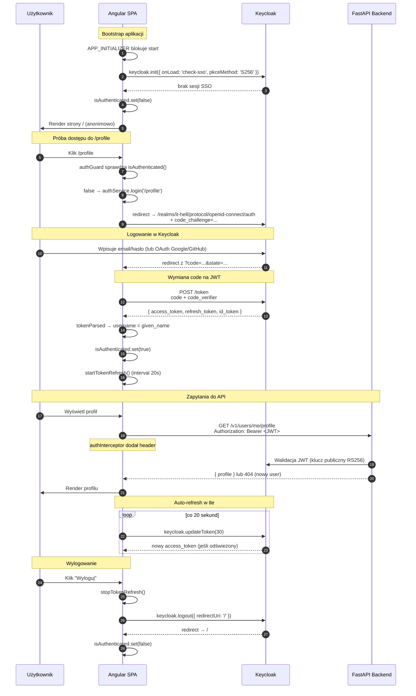

# 🔐 Auth Flow — Keycloak PKCE

Pełen opis przepływu autoryzacji w aplikacji CV_ANALIZER. Uzupełnienie [głównego README](../README.md).

## 📑 Spis treści

- [Stack autoryzacyjny](#stack-autoryzacyjny)
- [PKCE — co to i dlaczego](#pkce--co-to-i-dlaczego)
- [Bootstrap aplikacji (APP_INITIALIZER)](#bootstrap-aplikacji-app_initializer)
- [Pełen sequence diagram](#pełen-sequence-diagram)
- [Komponenty systemu](#komponenty-systemu)
- [Auto-refresh tokenu](#auto-refresh-tokenu)
- [SSR — pułapka i obejście](#ssr--pułapka-i-obejście)
- [Troubleshooting](#troubleshooting)

---

## Stack autoryzacyjny

| Element | Technologia | Wersja | Rola |
|---|---|---|---|
| Identity Provider | Keycloak | 26.6.0 | Wystawca JWT, formularze logowania, social login |
| SPA Client | `keycloak-js` | 26.2 | Biblioteka kliencka w Angularze |
| Flow | OAuth 2.0 Authorization Code + PKCE | S256 | Bezpieczny standard dla SPA |
| Token format | JWT (RS256 podpisany kluczem publicznym Keycloak) | — | Bearer token w nagłówku |
| Resource Server | FastAPI (backend) | — | Weryfikuje JWT przez klucz publiczny realmu |

**Konfiguracja realmu** (z `environment.ts`):

```typescript
{
  url: 'http://localhost:8080',
  realm: 'it-hell',
  clientId: 'backend-client'
}
```

> ℹ️ Konfiguracja realmu jest auto-importowana z `keyCloak/import/it-hell-realm.json` przy pierwszym starcie Keycloak (`compose.yaml` mountuje katalog jako `:ro` do `/opt/keycloak/data/import`). Późniejsze zmiany w JSON nie mają efektu — patrz [Troubleshooting](#troubleshooting).

---

## PKCE — co to i dlaczego

**PKCE (Proof Key for Code Exchange)** to rozszerzenie OAuth 2.0 Authorization Code Flow zaprojektowane dla klientów publicznych (SPA, mobile), które **nie mogą bezpiecznie przechować client secret**.

**Klasyczny problem:** SPA ma cały kod w przeglądarce. Każdy client secret tam zapisany jest publiczny.

**Rozwiązanie PKCE:**

1. SPA generuje losowy `code_verifier` (43-128 znaków).
2. Liczy `code_challenge = BASE64URL(SHA256(code_verifier))` — to **S256**.
3. Wysyła `code_challenge` do Keycloak przy starcie flow.
4. Po loginie Keycloak zwraca `authorization_code`.
5. SPA wymienia `code + code_verifier` na JWT. Keycloak weryfikuje że hash zgodny.
6. Atakujący który przechwycił `authorization_code` **nie zna `code_verifier`** — nie może wymienić na token.

**Konfiguracja w `auth.service.ts`:**

```typescript
await this.keycloak.init({
  onLoad: 'check-sso',
  pkceMethod: 'S256',
  // ...
});
```

---

## Bootstrap aplikacji (APP_INITIALIZER)

Aplikacja **musi wiedzieć od pierwszej klatki** czy użytkownik jest zalogowany — inaczej navbar pokaże „Zaloguj" mimo aktywnej sesji, a guard zablokuje `/profile` z migotaniem ekranu.

Rozwiązanie: blokujemy bootstrap na Keycloak init przez `APP_INITIALIZER` (`src/app/app.config.ts:31-40`):

```typescript
{
  provide: APP_INITIALIZER,
  useFactory: (auth: AuthService) => async () => {
    const timeout = new Promise<void>(resolve => setTimeout(resolve, 5000));
    await Promise.race([auth.init(), timeout]).catch((err) => {
      console.warn('[Auth] Keycloak unavailable — running without authentication.', err);
    });
  },
  deps: [AuthService],
  multi: true,
}
```

**Kluczowe decyzje:**

- **`Promise.race` z 5 s timeout** — aplikacja startuje nawet gdy Keycloak nie odpowiada. UX > kompletność.
- **`catch()` z logiem** — błąd inicjalizacji nie crashuje aplikacji, tylko ustawia `isAuthenticated = false`.

---

## Pełen sequence diagram



---

## Komponenty systemu

### 1. `AuthService` (singleton)

**Plik:** `src/features/auth/auth.service.ts`

Owija `keycloak-js` w API friendly dla Angulara (Signals zamiast eventów, async/await zamiast callbacków).

**Stan:**
```typescript
isAuthenticated = signal(false);
username = signal<string | null>(null);
```

**Init:**
```typescript
async init() {
  if (!isPlatformBrowser(this.platformId)) return;
  if (this.initialized) return;
  this.keycloak = new Keycloak(keycloakConfig);
  const ok = await this.keycloak.init({
    onLoad: 'check-sso',
    pkceMethod: 'S256',
    checkLoginIframe: false
  });
  this.initialized = true;
  this.isAuthenticated.set(ok);
  if (ok) {
    this.username.set(this.keycloak.tokenParsed?.['given_name'] ?? null);
    this.startTokenRefresh();
  }
}
```

### 2. `authInterceptor` (functional HTTP interceptor)

**Plik:** `src/app/app.config.ts:14-21`

```typescript
const authInterceptor: HttpInterceptorFn = (req, next) => {
  const auth = inject(AuthService);
  const token = auth.getToken();
  if (token && req.url.includes('/v1/')) {
    return next(req.clone({ setHeaders: { Authorization: `Bearer ${token}` } }));
  }
  return next(req);
};
```

**Selektywność:** dodaje token **tylko do żądań `/v1/*`** — nie do Keycloak, nie do asset CDN, nie do third-party.

### 3. `authGuard` (CanActivateFn)

**Plik:** `src/app/core/guards/auth.guard.ts`

```typescript
export const authGuard: CanActivateFn = (route, state) => {
  const auth = inject(AuthService);
  const router = inject(Router);
  if (auth.isAuthenticated()) return true;
  auth.login(state.url);  // redirect do Keycloak z powrotem na żądaną stronę
  return false;
};
```

Chroni tylko `/profile`. Inne strony są dostępne anonimowo.

### 4. `keycloak.config.ts`

**Plik:** `src/app/keycloak.config.ts`

Mostek z `environment.ts` do API `keycloak-js`:

```typescript
export const keycloakConfig = {
  url: environment.keycloakUrl,
  realm: environment.keycloakRealm,
  clientId: environment.keycloakClientId,
};
```

---

## Auto-refresh tokenu

**Cel:** użytkownik nigdy nie powinien zobaczyć "401 Unauthorized" tylko dlatego, że token wygasł w trakcie sesji (default 5 min w Keycloak).

**Mechanizm:**

```typescript
startTokenRefresh() {
  this.refreshIntervalId = window.setInterval(() => {
    this.refreshToken(30);  // odśwież jeśli wygasa za < 30 s
  }, 20_000);              // sprawdzaj co 20 s
}

async refreshToken(minValidity = 30): Promise<boolean> {
  try {
    return await this.keycloak.updateToken(minValidity);
  } catch {
    // Refresh token też wygasł — wyloguj
    this.logout();
    return false;
  }
}
```

**Dlaczego 20 s interval + 30 s minValidity:**
- 5 min token expiry / 20 s interval = 15 sprawdzeń przed expiry → bezpieczny margines
- `minValidity = 30` zapewnia że nawet jeśli żądanie API trwa 25 s, token będzie ważny do końca

**Zatrzymanie:**

```typescript
stopTokenRefresh() {
  if (this.refreshIntervalId !== null) {
    clearInterval(this.refreshIntervalId);
    this.refreshIntervalId = null;
  }
}
```

Wywoływane w `logout()` — bez tego po wylogowaniu interval próbowałby co 20 s refreshować nieistniejący token.

---

## SSR — pułapka i obejście

> 💡 **Stan obecny:** SSR jest **wyłączony w produkcji** (build w Dockerze tworzy SPA + nginx). Ta sekcja opisuje kod defensywny, który zostaje w razie ponownej aktywacji SSR — zobacz [`docs/architecture.md`](architecture.md#ssr--setup-w-kodzie-nieużywany-w-produkcji).

`keycloak-js` używa `window`, `localStorage`, `document.cookie` — **wszystkie niedostępne w Node.js** (SSR).

**Próba inicjalizacji Keycloak na serwerze → crash całego SSR procesu.**

### Obejście 1: Platform check w `AuthService.init()`

```typescript
async init() {
  if (!isPlatformBrowser(this.platformId)) return;  // SSR → no-op
  // ... reszta init
}
```

### Obejście 2: `RenderMode.Client` dla tras używających Keycloak

`/profile` jest chroniony `authGuard`, który używa `AuthService.isAuthenticated()`. Na serwerze sygnał **zawsze jest false** — guard zwróciłby redirect.

`src/app/app.routes.server.ts` ustawia trasy używające Keycloak jako `RenderMode.Prerender` (statyczny prerender bez wywoływania guarda) lub `RenderMode.Client` (renderowanie tylko w przeglądarce).

> ⚠️ **Krytyczna reguła:** jeśli dodajesz nową trasę używającą `authGuard` lub Keycloak, **musisz zdecydować o `RenderMode`** w `app.routes.server.ts`. Brak wpisu = trasa próbuje prerenderować z `isAuthenticated = false`, co psuje UX.

---

## Troubleshooting

| Problem | Przyczyna | Rozwiązanie |
|---|---|---|
| Po loginie wraca na `/` zamiast `/profile` | Brakuje `redirectUri` w `login()` | Sprawdź `auth.service.ts:login()` — powinno przekazywać `redirectPath` |
| `401 Unauthorized` mimo zalogowania | Token wygasł, refresh failed | Hard refresh (Ctrl+Shift+R) — re-init Keycloak |
| Realm `it-hell` not found | Volume `keycloak-data` istnieje ale realm nie zaimportowany | `docker compose down -v` → `docker compose up -d` (UWAGA: kasuje userów) |
| Zmiany w `it-hell-realm.json` nie działają | Realm już istnieje w volume — `--import-realm` jest skipped | Zmień przez Admin Console (`localhost:8080`) lub wipe volume |
| `CORS error` na żądaniach `/v1/*` | Backend zwrócił 500 (response bez nagłówków CORS) | `docker compose logs backend` — popraw błąd backendu, nie CORS |
| Po wylogowaniu w innej karcie ta nadal pokazuje "Zalogowano" | Brak `checkLoginIframe: true` (intencjonalnie wyłączone — powodował problemy z cookies) | Hard refresh karty — `init()` wykryje brak sesji |
| Logowanie kończy się błędem **SSR** | Trasa Prerender próbuje renderować Keycloak-zależny content | `app.routes.server.ts` — ustaw trasę na `RenderMode.Client` |
| `keycloak.init()` wisi 5+ sekund | Keycloak nie odpowiada | APP_INITIALIZER timeout zwolni bootstrap, aplikacja działa anonimowo |
| Social login (Google/GitHub) nie działa | Provider nie skonfigurowany w realmie | Admin Console → Identity Providers → dodaj |

---

## 📚 Powiązane dokumenty

- [`README.md`](../README.md) — quick-start i troubleshooting ogólny
- [`docs/architecture.md`](architecture.md) — wzorce Angular (Signals, APP_INITIALIZER)
- [`docs/api-services.md`](api-services.md) — jak token jest dołączany do API
- [`docs/features.md`](features.md) — features używające auth (profile)
