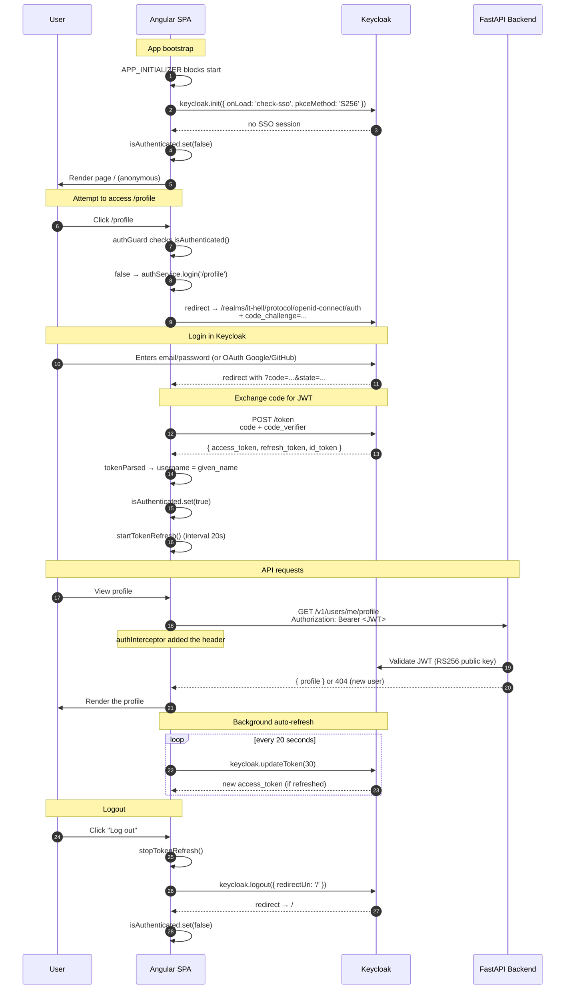

# 🔐 Auth Flow — Keycloak PKCE

A full description of the authorization flow in the IT-Hell app. Complements the [main README](../README.md).

## 📑 Table of contents

- [Authorization stack](#authorization-stack)
- [PKCE — what and why](#pkce--what-and-why)
- [App bootstrap (APP_INITIALIZER)](#app-bootstrap-app_initializer)
- [Full sequence diagram](#full-sequence-diagram)
- [System components](#system-components)
- [Token auto-refresh](#token-auto-refresh)
- [SSR — gotcha and workaround](#ssr--gotcha-and-workaround)
- [Troubleshooting](#troubleshooting)

---

## Authorization stack

| Element | Technology | Version | Role |
|---|---|---|---|
| Identity Provider | Keycloak | 26.6.0 | JWT issuer, login forms, social login |
| SPA Client | `keycloak-js` | 26.2 | Client library in Angular |
| Flow | OAuth 2.0 Authorization Code + PKCE | S256 | Secure standard for SPAs |
| Token format | JWT (RS256 signed with Keycloak's public key) | — | Bearer token in the header |
| Resource Server | FastAPI (backend) | — | Verifies the JWT against the realm's public key |

**Realm config** (from `environment.ts`):

```typescript
{
  url: 'http://localhost:8080',
  realm: 'it-hell',
  clientId: 'backend-client'
}
```

> ℹ️ The realm config lives in `frontend/it-hell-realm.json` and is **imported manually** through the Keycloak Admin Console on first run (`compose.yaml` does not auto-import it). Later changes to the JSON have no effect once the realm exists in the `keycloak-data` volume — see [Troubleshooting](#troubleshooting).

---

## PKCE — what and why

**PKCE (Proof Key for Code Exchange)** is an OAuth 2.0 Authorization Code Flow extension designed for public clients (SPA, mobile) that **cannot securely store a client secret**.

**The classic problem:** an SPA has all its code in the browser. Any client secret stored there is public.

**The PKCE solution:**

1. The SPA generates a random `code_verifier` (43-128 characters).
2. It computes `code_challenge = BASE64URL(SHA256(code_verifier))` — this is **S256**.
3. It sends the `code_challenge` to Keycloak when starting the flow.
4. After login Keycloak returns an `authorization_code`.
5. The SPA exchanges `code + code_verifier` for a JWT. Keycloak verifies the hash matches.
6. An attacker who intercepted the `authorization_code` **doesn't know the `code_verifier`** — they can't exchange it for a token.

**Config in `auth.service.ts`:**

```typescript
await this.keycloak.init({
  onLoad: 'check-sso',
  pkceMethod: 'S256',
  redirectUri: window.location.origin + window.location.pathname,
});
```

---

## App bootstrap (APP_INITIALIZER)

The app **must know from the first frame** whether the user is logged in — otherwise the navbar would show "Log in" despite an active session, and the guard would block `/profile` with a screen flicker.

The solution: block bootstrap on Keycloak init via `APP_INITIALIZER` (`src/app/app.config.ts`):

```typescript
{
  provide: APP_INITIALIZER,
  useFactory: (auth: AuthService) => async () => {
    const timeout = new Promise<void>(resolve => setTimeout(resolve, 5000));
    await Promise.race([auth.init(), timeout]).catch((err) => {
      console.warn('[Auth] Keycloak unavailable — running without authentication.', err);
    });
  },
  deps: [AuthService],
  multi: true,
}
```

**Key decisions:**

- **`Promise.race` with a 5s timeout** — the app starts even when Keycloak doesn't respond. UX > completeness.
- **`catch()` with a log** — an init error doesn't crash the app, it just leaves `isAuthenticated = false`.

---

## Full sequence diagram



---

## System components

### 1. `AuthService` (singleton)

**File:** `src/features/auth/auth.service.ts`

Wraps `keycloak-js` in an Angular-friendly API (Signals instead of events, async/await instead of callbacks). The Keycloak instance is created lazily via `createKeycloak()` (a protected method, overridable in tests).

**State:**
```typescript
isAuthenticated = signal(false);
username = signal<string | null>(null);
```

**Init (simplified):**
```typescript
async init() {
  if (!isPlatformBrowser(this.platformId)) return;  // SSR → no-op
  if (!this.keycloak) this.keycloak = this.createKeycloak();
  if (this.initialized) { this.updateAuthState(); return; }

  try {
    await this.keycloak.init({
      onLoad: 'check-sso',
      pkceMethod: 'S256',
      redirectUri: window.location.origin + window.location.pathname,
    });
  } catch {
    // Keycloak unavailable - the app runs logged-out
  }

  this.initialized = true;
  this.updateAuthState();      // reads keycloak.authenticated → sets the signals
  this.startTokenRefresh();
}
```

> Note: `init()` returns `void`. The auth state is derived in `updateAuthState()` from `keycloak.authenticated` and `keycloak.tokenParsed` (it reads `given_name`, falling back to `preferred_username`).

### 2. `authInterceptor` (functional HTTP interceptor)

**File:** `src/app/app.config.ts`

```typescript
const authInterceptor: HttpInterceptorFn = (req, next) => {
  const auth = inject(AuthService);
  const token = auth.getToken();
  if (token && req.url.includes('/v1/')) {
    return next(req.clone({ setHeaders: { Authorization: `Bearer ${token}` } }));
  }
  return next(req);
};
```

**Selectivity:** it adds the token **only to `/v1/*` requests** — not to Keycloak, not to asset CDNs, not to third parties.

### 3. `authGuard` (CanActivateFn)

**File:** `src/app/core/guards/auth.guard.ts`

```typescript
export const authGuard: CanActivateFn = async (_route, state) => {
  const auth = inject(AuthService);
  if (auth.isAuthenticated()) return true;
  await auth.login(state.url);  // redirect to Keycloak, then back to the requested page
  return false;
};
```

Protects only `/profile`. Other pages are available anonymously.

### 4. `keycloak.config.ts`

**File:** `src/app/keycloak.config.ts`

A bridge from `environment.ts` to the `keycloak-js` API:

```typescript
export const keycloakConfig = {
  url: environment.keycloakUrl,
  realm: environment.keycloakRealm,
  clientId: environment.keycloakClientId,
};
```

---

## Token auto-refresh

**Goal:** the user should never see a "401 Unauthorized" just because the token expired mid-session (default 5 min in Keycloak).

**Mechanism:**

```typescript
startTokenRefresh() {
  this.refreshIntervalId = window.setInterval(async () => {
    if (!this.isAuthenticated()) return;   // nothing to refresh when logged out
    await this.refreshToken(30);           // refresh if it expires in < 30s
  }, 20_000);                              // check every 20s
}

async refreshToken(minValidity = 30): Promise<boolean> {
  if (!this.keycloak) return false;
  try {
    await this.keycloak.updateToken(minValidity);
    this.updateAuthState();
    return true;
  } catch {
    // The refresh token expired too - clear local auth state and stop refreshing
    this.isAuthenticated.set(false);
    this.username.set(null);
    this.stopTokenRefresh();
    return false;
  }
}
```

> Note: on a refresh failure the service clears the local auth state and stops the interval — it does **not** redirect to the Keycloak logout endpoint.

**Why a 20s interval + 30s minValidity:**
- 5 min token expiry / 20s interval = ~15 checks before expiry → a safe margin
- `minValidity = 30` ensures that even if an API request goes out just before expiry, the token stays valid long enough

**Stopping:**

```typescript
stopTokenRefresh() {
  if (this.refreshIntervalId !== null) {
    window.clearInterval(this.refreshIntervalId);
    this.refreshIntervalId = null;
  }
}
```

Called in `logout()` — without it, after logout the interval would keep trying to refresh a non-existent token every 20s.

---

## SSR — gotcha and workaround

`keycloak-js` uses `window`, `localStorage`, `document.cookie` — **all unavailable in Node.js** (SSR).

**Trying to initialize Keycloak on the server → crashes the whole SSR process.**

> Reminder: SSR is currently **not wired into the build** (see [architecture.md](architecture.md)). The app ships as a client-only SPA. The guards below still matter and are kept ready for when SSR is enabled.

### Workaround 1: platform check in `AuthService.init()`

```typescript
async init() {
  if (!isPlatformBrowser(this.platformId)) return;  // SSR → no-op
  // ... rest of init
}
```

### Workaround 2: `RenderMode.Client` for routes that use Keycloak

`/profile` is protected by `authGuard`, which uses `AuthService.isAuthenticated()`. On the server the signal is **always false** — the guard would redirect.

`src/app/app.routes.server.ts` sets routes as `RenderMode.Prerender` (static prerender without running the guard) or `RenderMode.Client` (browser-only rendering).

> ⚠️ **Critical rule (once SSR is enabled):** if you add a new route using `authGuard` or Keycloak, you **must decide its `RenderMode`** in `app.routes.server.ts`. A missing entry = the route tries to prerender with `isAuthenticated = false`, which breaks UX.

---

## Troubleshooting

| Problem | Cause | Fix |
|---|---|---|
| After login it returns to `/` instead of `/profile` | Missing `redirectUri` in `login()` | Check `auth.service.ts:login()` — it should pass `redirectPath` |
| `401 Unauthorized` despite being logged in | Token expired, refresh failed | Hard refresh (Ctrl+Shift+R) — re-init Keycloak |
| Realm `it-hell` not found | The `keycloak-data` volume exists but the realm wasn't imported | Import `frontend/it-hell-realm.json` via the Admin Console, or `docker compose down -v` and re-import (WARNING: deletes users) |
| Changes to `it-hell-realm.json` don't take effect | The realm already exists in the volume | Change it via the Admin Console (`localhost:8080`) or wipe the volume |
| `CORS error` on `/v1/*` requests | The backend returned 500 (response without CORS headers) | `docker compose logs backend` — fix the backend error, not CORS |
| After logging out in another tab, this one still shows "logged in" | The login-iframe check isn't used | Hard refresh the tab — `init()` will detect the missing session |
| Login fails with an **SSR** error (once SSR is on) | A Prerender route tries to render Keycloak-dependent content | `app.routes.server.ts` — set the route to `RenderMode.Client` |
| `keycloak.init()` hangs 5+ seconds | Keycloak isn't responding | The APP_INITIALIZER timeout releases bootstrap; the app runs anonymously |
| Social login (Google/GitHub) doesn't work | The provider isn't configured in the realm | Admin Console → Identity Providers → add |

---

## 📚 Related documents

- [`README.md`](../README.md) — quick-start and general troubleshooting
- [`docs/architecture.md`](architecture.md) — Angular patterns (Signals, APP_INITIALIZER, SSR status)
- [`docs/api-services.md`](api-services.md) — how the token is attached to API calls
- [`docs/features.md`](features.md) — features that use auth (profile)
