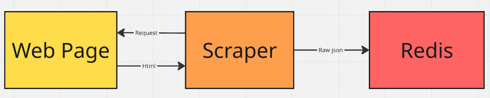

# Scrapers Documentation
IT-Hell Scrapers is a data collection project designed to concurrently scrape job listings from popular Polish IT job boards ([pracuj.pl](https://it.pracuj.pl/praca), [theprotocol.it](https://theprotocol.it/praca)). It utilizes asynchronous requests and browser impersonation to reliably extract job offers, parses them into structured data models, and pushes the results into a Redis Stream for further processing.

## Getting started
1. **Environment Setup**:
   - Ensure you have Python 3.8+ installed.
   - Install the [uv](https://docs.astral.sh/uv/getting-started/installation/) package manager if you haven't installed yet.
   - Ensure you have configured Redis correctly.
2. **Install dependencies**:
   - Run `uv sync` to install the required dependencies from `pyproject.toml`.
3. **Setup environment variables**:
   - Create a `.env` file in the root of the project with the following content (adjust values as needed):
     ```
      REDIS_HOST=
      REDIS_PORT=
      REDIS_DB=
      REDIS_PASSWORD=
      REDIS_STREAM=
      REDIS_GROUP=
      REDIS_CONSUMER=

     ```
4. **Configure scrapers (optional)**:
   - Edit `app-config.yaml` to adjust scraper settings.
5. **Run scrapers**:
    1. Run all scrapers:
    ```
    uv run main.py
    ```
    2. Run specific scraper (pracuj_pl, theprotocol_it):
    ```
    uv run main.py -s scraper_name
    ```

## Architecture and Data Flow
1. **Runner (`main.py`)**: Acts as the asynchronous entry point. It instantiates the chosen scraper classes and runs their main loops concurrently.
2. **Scraping Engine**:
   - Uses `curl_cffi` for HTTP requests, applying TLS fingerprinting (browser impersonation) to bypass basic anti-bot defenses.
   - Paginates through listings, fetches job HTML pages, and places items into an `asyncio.Queue`.
3. **Data Parsing & Validation**:
   - The raw HTML is parsed using helper functions (e.g., extracting JSON data from `<script>` tags).
   - The data is mapped to structured and validated Pydantic models (`JobOffer`).
4. **Redis Integration**:
   - A dedicated asynchronous worker consumes the enriched `JobOffer` items from a queue.
   - Serializes the items to JSON and pushes them to a Redis Stream (`REDIS_STREAM`) using the `XADD` command.

### Data flow diagram


## File Structure
```text
scrapers/
├── .env                # Environment variables
├── main.py             # Entry point for running scrapers
├── pyproject.toml      # Project dependencies managed by uv
├── README.md           # Documentation
├── app-config.yaml     # Configuration file for scraper settings
├── logs/               # Application log files
├── src/                
│   ├── core/           # Core modules (e.g., Redis client connection)
│   ├── pracuj_pl/      # scraper implementation and data extraction for pracuj.pl
│   ├── theprotocol_it/ # scraper implementation and data extraction for theprotocol.it
│   ├── helpers.py      # HTML to JSON parsing utilities
│   └── schemas.py      # Pydantic data models for validation
└── tests/              # Pytest test suite and mock HTML data
```

